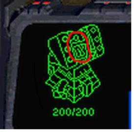

# [boj]터렛

<!-- TOC -->

- [[boj]터렛](#boj%ED%84%B0%EB%A0%9B)
  - [문제](#%EB%AC%B8%EC%A0%9C)
  - [입력](#%EC%9E%85%EB%A0%A5)
  - [출력](#%EC%B6%9C%EB%A0%A5)
  - [예시](#%EC%98%88%EC%8B%9C)
  - [숙고 1](#%EC%88%99%EA%B3%A0-1)
  - [코드 1](#%EC%BD%94%EB%93%9C-1)

<!-- /TOC -->

## 문제

- https://www.acmicpc.net/problem/1002

조규현과 백승환은 터렛에 근무하는 직원이다. 하지만 워낙 존재감이 없어서 인구수는 차지하지 않는다. 다음은 조규현과 백승환의 사진이다.



이석원은 조규현과 백승환에게 상대편 마린(류재명)의 위치를 계산하라는 명령을 내렸다. 조규현과 백승환은 각각 자신의 터렛 위치에서 현재 적까지의 거리를 계산했다.

조규현의 좌표 (x1, y1)와 백승환의 좌표 (x2, y2)가 주어지고, 조규현이 계산한 류재명과의 거리 r1과 백승환이 계산한 류재명과의 거리 r2가 주어졌을 때, 류재명이 있을 수 있는 좌표의 수를 출력하는 프로그램을 작성하시오.

## 입력


첫째 줄에 테스트 케이스의 개수 T가 주어진다. 각 테스트 케이스는 다음과 같이 이루어져 있다.

한 줄에 x1, y1, r1, x2, y2, r2가 주어진다. x1, y1, x2, y2는 -10,000보다 크거나 같고, 10,000보다 작거나 같은 정수이고, r1, r2는 10,000보다 작거나 같은 자연수이다.

## 출력

각 테스트 케이스마다 류재명이 있을 수 있는 위치의 수를 출력한다. 만약 류재명이 있을 수 있는 위치의 개수가 무한대일 경우에는 -1을 출력한다.

## 예시

```python
example 1:
Input:
3
0 0 13 40 0 37
0 0 3 0 7 4
1 1 1 1 1 5
output:
2
1
0
```

## 숙고 1
감을 못잡았는데 알고보니 두 원의 위치관계를 알면 되는거더라..  
1. 두 원이 같을 때 -> -1 반환  
2. 두 원이 한 점에서 만날때(외접, 내접) -> 1 반환  
3. 두 원이 만나지 않을때 -> 0 반환  
4. 두 원이 두 점에서 만날때(교집합 형태) -> 2 반환   

두 점사이의 거리를 구하는 공식  
r = sqrt((x1-x2)**2 + (y1-y2)**2)  

## 코드 1
- https://github.com/yogoloper/TIL/blob/master/Algorithm/Baekjoon-Online-Judge/1002_01.py

```python
case = int(input())

for i in range(case):
    x1, y1, r1, x2, y2, r2 = map(int, input().split())

    # 두 점 사이이를 구하는 공식
    r = ((x1 - x2)**2 + (y1 - y2)**2)**(1/2)
    
    # 원의 위치 관계를 판결하기 위해 두 원의 반지름과 두 점 사이의 거리의 크기를 비교하여 제일 큰 값을 제거한다.
    R = [r1, r2, r]
    m = max(R)
    R.remove(m)
    
    # 두 점 사이의 거리가 0이고 두 점이 같다면 두 원의 크기는 같으며,
    # 적 위치 경우의 수가 무한대이므로 -1 반환
    if r == 0 and r1 == r2:
        print(-1)
    # 두 점사이의 거리가 두 원의 반지릅의 합이면 외접,
    #  두 점 사이의 거리가 한 원의 반지름 값과 같다면 내접하는 것으로
    # 1 반환
    elif r == r1 + r2 or m == sum(R):
        print(1)
    # 두 점사이의 거리가 두 원의 반지름의 합보다 크다면 두 원은 만나지 않으며,
    # 적이 있는 위치의 경우의 수가 존재하지 않는다. 0 반환
    elif m > sum(R):
        print(0)
    # 그 외의 경우는 두 원이 두 점으로 접하는 경우이므로
    # 2 반환 
    else:
        print(2)

```
