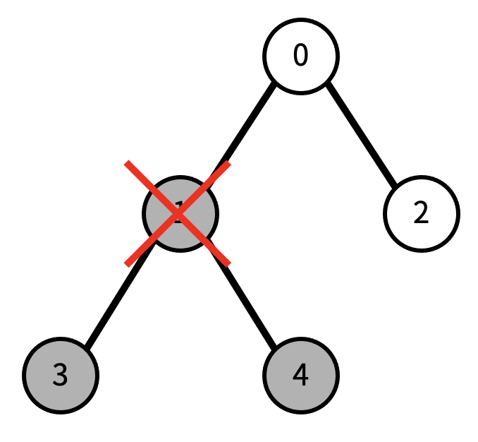

# [boj]트리

<!-- TOC -->

- [[boj]트리](#boj%ED%8A%B8%EB%A6%AC)
  - [문제](#%EB%AC%B8%EC%A0%9C)
  - [입력](#%EC%9E%85%EB%A0%A5)
  - [출력](#%EC%B6%9C%EB%A0%A5)
  - [예시](#%EC%98%88%EC%8B%9C)
  - [숙고 1](#%EC%88%99%EA%B3%A0-1)
  - [코드 1](#%EC%BD%94%EB%93%9C-1)

<!-- /TOC -->

## 문제
- 문제 : https://www.acmicpc.net/problem/1068
- 트리에서 리프 노드란, 자식의 개수가 0인 노드를 말한다.  
  트리가 주어졌을 때, 노드 하나를 지운다.  
  그 때 남은 트리에서 리프 노드의 개수를 구하는 프로그램을 작성하여라.  
  노드를 지우면 그 노드와 노드의 모든 자손이 트리에서 제거된다.  
  예를 들어, 다음과 같은 트리가 있다고 할 때,
  

  현재 리프 노드의 개수는 3개이다.  
  이때, 1번을 지우면, 다음과 같이 변한다. 
  

  이제 리프 노드의 개수는 1이다.


## 입력
- 첫째 줄에 트리의 노드의 개수 N이 주어진다.  
  N은 50보다 작거나 같은 자연수이다.  
  둘째 줄에는 0번 노드부터 N-1번 노드까지, 각 노드의 부모가 주어진다.  
  만약 부모가 없다면 (루트) -1이 주어진다.  
  셋째 줄에는 지울 노드의 번호가 주어진다.

## 출력
- 첫째 줄에 입력으로 주어진 트리에서 입력으로 주어진 노드를 지웠을 때,  
  리프 노드의 개수를 출력한다.

## 예시
``` python
example 1:
Input:
5
-1 0 0 1 1
2
output:
2

example 2:
Input:
5
-1 0 0 1 1
1
output:
1

example 3:
Input:
5
-1 0 0 1 1
0
output:
0

example 4:
Input:
9
-1 0 0 2 2 4 4 6 6
4
output:
2
```

## 숙고 1
- 문제를 이해하는데 오래걸렸다.  
  입력 받는 노드의 정보는 부모 노드를 가리키는 것..
  입력 예시 4번의 트리는 아래와 같으며,  
  4번 인덱스 노드를 제거하면 4, 5, 6, 7, 8 노드들이 삭제된다.
```
 0
1 2
 3 4
  5 6
   7 8
```
- 입받은 배열의 인덱스 까지만 트리를 만들면 안되는걸까?
  -> 부모 노드를 한쪽에 치우쳐서 입력하란 법이 없으므로 안될것 같다.
- 지울 인덱스를 부모로 가진 노드들을 따라가 지우고 그 노드들을 부모로 가진 노드들을 따라가서 지우면 될 것 같다.

## 코드 1
- https://github.com/yogoloper/TIL/blob/master/Algorithm/Baekjoon-Online-Judge/1068_01.py  
``` python
def dfs(num, arr):
    # 입력 받은 노드의 값을 -2로 변경하여 지웠다고 표시
    arr[num] = -2
    # -2로 변경한 노드를 부모로 가진 노드들을 찾아
    # DFS 구조를 통해 -2로 지워준다.
    for i in range(len(arr)):
        if num == arr[i]:
            dfs(i, arr)

n = int(input())
arr = list(map(int, input().split()))
k = int(input())

# 최초로 입력 받은 노드를 지우기 위해 호출
dfs(k, arr)

# 리프 노드를 카운팅 할 변수
count = 0
# 전체 입력받은 배열 만큼 반복하며
for i in range(len(arr)):
    # 지운 노드(-2로 표시)가 아니고
    # 해당 노드의 인덱스가 배열에 없는 것만을 카운팅
    # -> 인덱스가 배열에 있다는 것은 자식 노드가 있다는 것을 뜻함
    if arr[i] != -2 and i not in arr:
        count += 1
```