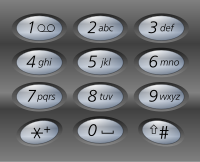

# 전화 번호 문자 조합

<!-- TOC -->

- [전화 번호 문자 조합](#%EC%A0%84%ED%99%94-%EB%B2%88%ED%98%B8-%EB%AC%B8%EC%9E%90-%EC%A1%B0%ED%95%A9)
  - [문제](#%EB%AC%B8%EC%A0%9C)
  - [예시](#%EC%98%88%EC%8B%9C)
  - [숙고 1](#%EC%88%99%EA%B3%A0-1)
  - [코드 1](#%EC%BD%94%EB%93%9C-1)
  - [숙고 2](#%EC%88%99%EA%B3%A0-2)
  - [코드 2](#%EC%BD%94%EB%93%9C-2)

<!-- /TOC -->

## 문제
- https://leetcode.com/problems/letter-combinations-of-a-phone-number/
- 2에서 9까지의 숫자를 포함하는 문자열이 주어지면 숫자가 나타낼 수 있는 모든 가능한 문자 조합을 반환한다.  
  임의의 순서로 답을 반환하여라.
- 전화 버튼과 마찬가지로 숫자 대 문자 매핑이 아래에 나와있으며, 1은 어떤 문자에도 매핑되지 않는다.  
  

## 예시
``` python
Example 1:
Input: digits = "23"
Output: ["ad","ae","af","bd","be","bf","cd","ce","cf"]

Example 2:
Input: digits = ""
Output: []

Example 3:
Input: digits = "2"
Output: ["a","b","c"]
```

## 숙고 1
- digits의 크기는 최대 4니까 4번까지 반복문 동적으로 돌게 해보면 되려나..  
  반복문은 동적으로 만들수가 없다..
- 재귀에 도전해보자  
  digits 문자열을 리스트로 만들고 문자열 리스트의 값이 있을때까지 재귀 함수를 돌며  
  함수에서 반환된 리스트랑 현재 리스트랑 두 개 리스트를 돌면서 문자를 합쳐주면 될 듯 하다.
- 실패했다.. 탈출 조건이 잘못된 것 같다..

## 코드 1
- https://github.com/yogoloper/TIL/blob/master/Algorithm/algorithm-interview/12_33_letter-combinations-of-a-phone-number_01.py
``` python
class Solution:
  dic = {
    '2' : ['a', 'b', 'c'],
    '3' : ['d', 'e', 'f'],
    '4' : ['g', 'h', 'i'],
    '5' : ['j', 'k', 'l'],
    '6' : ['m', 'n', 'o'],
    '7' : ['p', 'q', 'r', 's'],
    '8' : ['t', 'u', 'v'],
    '9' : ['w', 'x', 'y', 'z']
  }
  
  def letterCombinations(self, digits: str) -> List[str]:
    def recursion(digits: List[str]) -> List[str]:
      result = []
    
      if not digits:
        return []

      str = self.dic[digits.pop()]
      com_str = recursion(digits)
      
      for i in str:
        for j in com_str:
          result.append(i+j)
      
      return result
    
    result = []

    digits = list(digits)
    result = recursion(digits)

    return result
```

## 숙고 2
- 풀이를 보자.. 어렵다..  
- 동작 방식은 이렇다.  
  234를 입력했다고 했을때 아래의 트리구조를 통해 위에서 아래로 접근하며 문자열 조합을 한다.  
  abc  
  def  
  ghi   

  a로 조합 가능한 문자조합은 adg, adh, adi, aeg, aeh, aei, afg, afh, afi 이며,  
  path를 통해 문자를 조합해주며, 문자조합의 길이가 뎁스(문자 조합 깊이)와 같아 지면 결과에 추가한다.

## 코드 2
- https://github.com/yogoloper/TIL/blob/master/Algorithm/algorithm-interview/12_33_letter-combinations-of-a-phone-number_02.py
``` python
class Solution:
  dic = {
    '2' : 'abc',
    '3' : 'def',
    '4' : 'ghi',
    '5' : 'jkl',
    '6' : 'mno',
    '7' : 'pqrs',
    '8' : 'tuv',
    '9' : 'wxyz',
  }
  
  def letterCombinations(self, digits: str) -> List[str]:
    def dfs(index, path):
      # 탈출 조건
      # 문자 조합과 뎁스(문자 조합 길이)가 같으면 탈출한다.
      if len(path) == len(digits):
        result.append(path)
        return
    
      # 첫 번째 반복은은 옆으로 펼쳐지는 트리를 표현
      for i in range(index, len(digits)):
        # 두 번째 반복문은 뎁스를 타고 내려가는걸 표현
        for j in self.dic[digits[i]]:
          dfs(i + 1, path + j)
    
    if not digits:
      return []
    
    result = []
    dfs(0, "")
    
    return result
```
