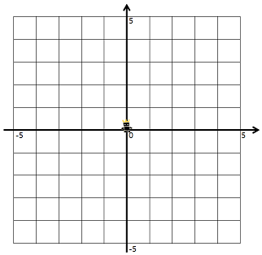
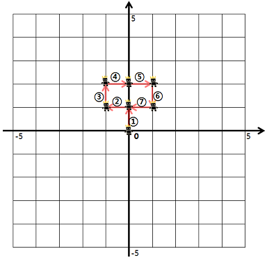
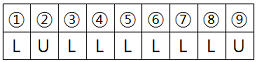
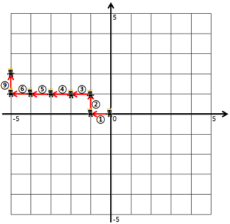

# 방문 길이

<!-- TOC -->

- [방문 길이](#%EB%B0%A9%EB%AC%B8-%EA%B8%B8%EC%9D%B4)
  - [문제](#%EB%AC%B8%EC%A0%9C)
  - [제한 조건](#%EC%A0%9C%ED%95%9C-%EC%A1%B0%EA%B1%B4)
  - [예시](#%EC%98%88%EC%8B%9C)
  - [숙고 1](#%EC%88%99%EA%B3%A0-1)
  - [코드 1](#%EC%BD%94%EB%93%9C-1)

<!-- /TOC -->

## 문제
- 문제 : https://programmers.co.kr/learn/courses/30/lessons/49994
- 게임 캐릭터를 4가지 명령어를 통해 움직이려 합니다. 명령어는 다음과 같습니다.  
  - U: 위쪽으로 한 칸 가기
  - D: 아래쪽으로 한 칸 가기
  - R: 오른쪽으로 한 칸 가기
  - L: 왼쪽으로 한 칸 가기
  
  캐릭터는 좌표평면의 (0, 0) 위치에서 시작합니다.  
  좌표평면의 경계는 왼쪽 위(-5, 5), 왼쪽 아래(-5, -5), 오른쪽 위(5, 5), 오른쪽 아래(5, -5)로 이루어져 있습니다.

  
예를 들어, "ULURRDLLU"로 명령했다면  
  
1번 명령어부터 7번 명령어까지 다음과 같이 움직입니다.  
  
8번 명령어부터 9번 명령어까지 다음과 같이 움직입니다.  
  
이때, 우리는 게임 캐릭터가 지나간 길 중 캐릭터가 처음 걸어본 길의 길이를 구하려고 합니다. 예를 들어 위의 예시에서 게임 캐릭터가 움직인 길이는 9이지만, 캐릭터가 처음 걸어본 길의 길이는 7이 됩니다. (8, 9번 명령어에서 움직인 길은 2, 3번 명령어에서 이미 거쳐 간 길입니다)  

단, 좌표평면의 경계를 넘어가는 명령어는 무시합니다.  

예를 들어, "LULLLLLLU"로 명령했다면  
  
1번 명령어부터 6번 명령어대로 움직인 후, 7, 8번 명령어는 무시합니다. 다시 9번 명령어대로 움직입니다.  
  
이때 캐릭터가 처음 걸어본 길의 길이는 7이 됩니다.

명령어가 매개변수 dirs로 주어질 때, 게임 캐릭터가 처음 걸어본 길의 길이를 구하여 return 하는 solution 함수를 완성해 주세요.  

## 제한 조건
- dirs는 string형으로 주어지며,  
  'U', 'D', 'R', 'L' 이외에 문자는 주어지지 않습니다.  
  dirs의 길이는 500 이하의 자연수입니다.


## 예시
<table class="table">
<thead><tr>
<th>dirs</th>
<th>answer</th>
</tr>
</thead>
<tbody><tr>
<td>"ULURRDLLU"</td>
<td>7</td>
</tr>
<tr>
<td>"LULLLLLLU"</td>
<td>7</td>
</tr>
</tbody>
</table>

## 숙고 1
- 이동 명령에 대한 추가 값들을 저장한다.
  - U : (0, +1)
  - D : (0, -1)
  - R : (+1, 0)
  - L : (-1, 0)
- dirs를 받아와서 리스트에 담아 이동 명령어를 차례대로 추출한다.
- 이동 명령이 들어오면,  
  좌표평면의 값을 출발좌표 : 도착좌표로 dictionary에 저장한다.
  U 명령이면 { '0,0' : ['1,0']}
- 출발좌표 키에 맞게 도착 좌표에 값이 없다면 새로운길 카운트 업
## 코드 1
- https://github.com/yogoloper/TIL/blob/master/Algorithm/programmers/49994_01.py
``` python
def solution(dirs):
    answer = 0
    
    before_x = 0
    before_y = 0
    after_x = 0
    after_y = 0
    
    dirs = list(dirs)
    move = collections.defaultdict(list)

    for i in dirs:
        if i == 'U':
            if after_y >= 5:
                continue
            after_y += 1
        elif i == 'D':
            if after_y <= -5:
                continue
            after_y -= 1
        elif i == 'R':
            if after_x >= 5:
                continue
            after_x += 1
        elif i == 'L':
            if after_x <= -5:
                continue
            after_x -= 1

        if [after_x,after_y] not in move[str(before_x)+','+str(before_y)]:
            move[str(before_x)+','+str(before_y)].append([after_x, after_y])
            # 이 부분이 없어서 테스트 통과를 못했다.
            # 같은 좌표는 올라가든 내려가든 다녀간 길로 체크하기 위해 추가
            move[str(after_x)+','+str(after_y)].append([before_x, before_y])
            answer += 1
        before_x = after_x
        before_y = after_y
    
    return answer
```
