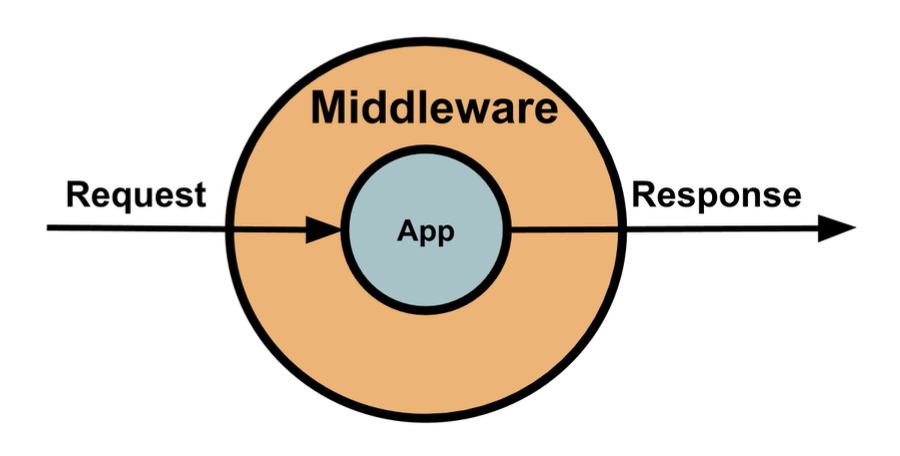
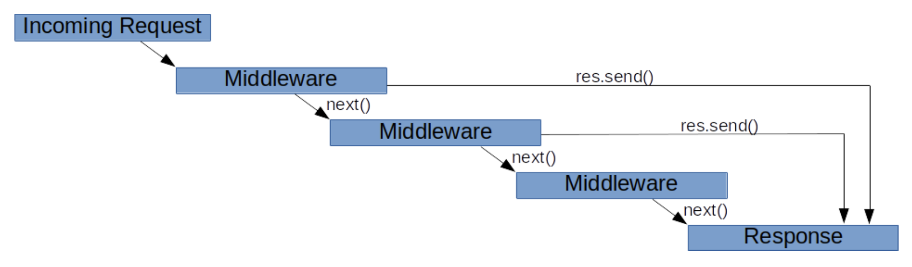
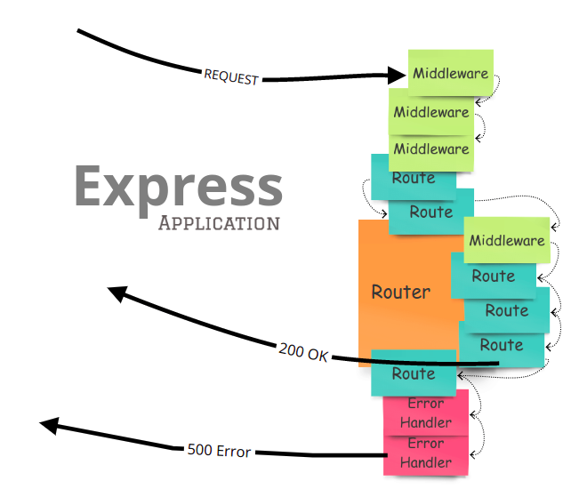

<!-- TOC -->

- [Express](#express)
  - [middleware](#middleware)
  - [express.js에서 middleware 만들기](#expressjs%EC%97%90%EC%84%9C-middleware-%EB%A7%8C%EB%93%A4%EA%B8%B0)
    - [middleware 순차적 실행](#middleware-%EC%88%9C%EC%B0%A8%EC%A0%81-%EC%8B%A4%ED%96%89)
  - [express.Router](#expressrouter)
    - [Routing](#routing)
    - [express.Router 사용 이유](#expressrouter-%EC%82%AC%EC%9A%A9-%EC%9D%B4%EC%9C%A0)
    - [epxress routing 과정](#epxress-routing-%EA%B3%BC%EC%A0%95)

<!-- /TOC -->

# Express
Node.js를 위한 웹 프레임워크의 하나로,  
라우팅, 정적파일 호스팅 관리, 템플릿 엔진, 보안 세션, 여러 API를 제공한다.

주로 express()의 객체를 app에 담아서 사용한다.

## middleware
미들웨어는 요청/응답 **(req/res)** 객체 그리고 어플리케이션 요청-응답 사이클 도중 그 다음의 미들웨어에 대한 엑세스 권한 **(next)** 을 갖는 함수이다.  
즉, 클라이언트의 요청에 응답을 해야 하는데, 그 중간과정에서 목적에 맞게 처리하는(거쳐가는) 함수이다.


아래의 예시 처럼 express()의 객체를 담아 사용하는 app에서 use()를 통하면 미들웨어들을 사용할 수 있으며 순차적으로 실행된다. 
``` javascript
app.use(express.static('static'));
app.use(express.json());
app.use(requestMiddleware);

app.use('/api', [goodsRouter]);

app.get('/', (req, res) => {
  res.send('hello world!');
});
```

## express.js에서 middleware 만들기
req: 요청에 대한 정보가 담겨있는 객체  
res: 응답을 하기 위한 기능이 담겨있는 객체  
next: 다음 미들웨어를 호출하는 함수
``` javascript
app.use((req, res, next) => { 
  // 필요한 코드
});
```

### middleware 순차적 실행
미들웨어가 겹쳐 있으면 res 객체로 반환할때까지 차례로 실행된다.  
res와 next()를 같이 사용하면 에러가 발생한다.
``` javascript
app.use((req, res, next) => { 
  console.log('middleware 1'); 
  next();
});
app.use((req, res, next) => { 
  console.log('middleware 2'); 
  next();
});
app.use((req, res, next) => { 
  console.log('middleware 3'); 
  next();
});
```


## express.Router()
라우터 레벨 미들웨어는 express.Router() 인스턴스에 바인드된다는 점을 제외하면 애플리케이션 레벨 미들웨어와 동일한 방식으로 작동한다.

### Routing
클라이언트의 요청 조건(메서드, 주소등)에 대응해 응답하는 방식이다.

### express.Router() 사용 이유
어플리케이션 레벨 미들웨어인 app.use(), app.METHOD()를 사용해서도 라우팅이 가능하지만,  
라우터 레벨 미들웨어를 사용하면 **특정 root URL** 을 지정해서 **기능, 로직등을 구분** 해서 라우팅을 나누어 관리가 가능하다.

### epxress routing 과정

