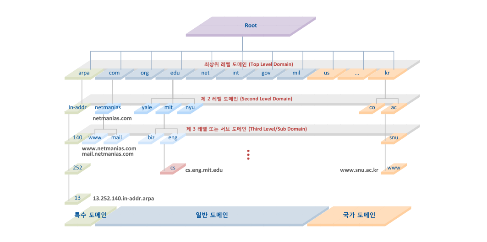

<!-- TOC -->

- [DNS](#dns)
  - [Domain Name Space](#domain-name-space)
  - [Name Server](#name-server)
  - [Resolver](#resolver)
  - [DNS 쿼리 과정](#dns-%EC%BF%BC%EB%A6%AC-%EA%B3%BC%EC%A0%95)

<!-- /TOC -->

# DNS
Domain Name System은 사람이 읽을 수 있는 도메인 이름(예: www.amazon.com)을 컴퓨터가 읽을 수 있는 IP 주소(예: 192.0.2.44)로 변환해준다.

인터넷 상의 모든 컴퓨터는 숫자를 사용하여 서로를 찾고 통신한다. 이러한 숫자를 **IP 주소** 라고 하며, 사용자는 이러한 긴 숫자를 알 필요없이 **도메인** 을 사용해서 원하는 사이트에 접속한다.  

**DNS server** 는 이름과 숫자간의 매핑을 관리하여 전화번호부와 같은 기능을 제공한다. DNS server는 사용자가 웹 브라우저에 도메인 이름을 입력했을 때, 이름에 대한 요청을 IP 주소로 변환하여 사용자를 어떤 서버에 연결할 것인지를 제어한다. 이러한 요청을 **쿼리** 라고 부른다.

## Domain Name Space
주소 체계  

Root: 도메인의 가장 끝에 있는 점(.), 주로 생략  
Top-level: root의 직속 하위 도메인  
-> com, net, co.kr 등
Second-level: Top-level 도메인의 직속 하위 도메인  
Sub: Second-level 도메인의 직속 하위 도메인  

이러한 각각의 도메인을 전담하는 독자적인 서버인 Name Server 존재한다.  

## Name Server
문자열로 표현된 도메인 이름을 실제 컴퓨터가 통신할 때 사용되는 IP 주소로 변환시켜 주기 위해서는 Domain Name Space의 트리 구조에 대한 정보가 필요하다.  

이러한 정보를 가지고 있는 서버를 Name Server라 하며, 이러한 도메인 이름을 IP 주소로 변환하는 것을 Name Service라고 한다.

## Resolver
웹 브라우저와 같은 클라이언트의 요청을 Name Server로 전달하고 Name Server로부터 정보(도메인 이름과 IP 주소)를 받아 클라이언트에게 제공하는 기능을 수행한다.  

Root Name Server부터 DNS 요청을 전달하고 해당 서버에 정보가 없으면 다른 하위 Name Server에 요청을 보내 정보를 받아온다.

## DNS 쿼리 과정

1. 사용자가 웹 브라우저를 열어 주소 표시줄에 www.example.com을 입력한다.

2. www.example.com에 대한 요청은 일반적으로 케이블 인터넷 공급업체, DSL 광대역 공급업체 또는 기업 네트워크 같은 **인터넷 서비스 제공업체(ISP)** 가 관리하는 DNS resolver로 라우팅한다.

3. ISP의 DNS resolver는 www.example.com에 대한 요청을 DNS 루트 Name Server에 전달한다.

4. ISP의 DNS resolver는 www.example.com에 대한 요청을 이번에는 .com 도메인의 TLD Name Server 중 하나에 다시 전달하고,  .com 도메인의 Name Server는 example.com 도메인과 연관된 4개의 Amazon Route 53 Name Server의 이름을 사용하여 요청에 응답한다.

5. ISP의 DNS resolver는 Amazon Route 53 Name Server 하나를 선택해 www.example.com에 대한 요청을 해당 Name Server에 전달한다.

6. Amazon Route 53 Name Server는 example.com 호스팅 영역에서 www.example.com 레코드를 찾아 웹 서버의 IP 주소 192.0.2.44 등 연관된 값을 받고 이 IP 주소를 DNS resolver로 반환한다.

7. ISP의 DNS resolver가 마침내 사용자에게 필요한 IP 주소를 확보하게 됩니다. resolver는 이 값을 웹 브라우저로 반환하고,  또한, DNS resolver는 다음에 누군가가 example.com을 탐색할 때 좀 더 빠르게 응답할 수 있도록 사용자가 지정하는 일정 기간 example.com의 IP 주소를 캐싱(저장)한다.

8. 웹 브라우저는 DNS resolver로부터 얻은 IP 주소로 www.example.com에 대한 요청을 전송한다.

9. 192.0.2.44에 있는 웹 서버 또는 그 밖의 리소스는 www.example.com의 웹 페이지를 웹 브라우저로 반환하고, 웹 브라우저는 이 페이지를 표시한다.
