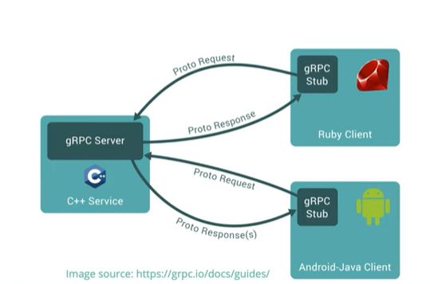

<!-- TOC -->

- [gRPC 프로토콜](#grpc-%ED%94%84%EB%A1%9C%ED%86%A0%EC%BD%9C)
  - [RPC Remote Communication Mechanism](#rpc-remote-communication-mechanism)
  - [gRPC 작동원리](#grpc-%EC%9E%91%EB%8F%99%EC%9B%90%EB%A6%AC)
  - [gRPC vs RestAPI](#grpc-vs-restapi)
  - [gRPC 단점](#grpc-%EB%8B%A8%EC%A0%90)

<!-- /TOC -->

# gRPC 프로토콜
gRPC는 Google에서 개발한 RPC(Remote Procedure Call) 시스템으로, 전송을 위해 TCP/IP 프로토콜과 HTTP 2.0 프로토콜을 사용하고 IDL(Interface Definition language)로 protocol buffer를 사용한다.

하나의 proto 파일을 사용해서 go, python, java, swift 등 다양한 언어의 서버/클라이언트 코드를 생성할 수 있다.

## RPC (Remote Communication Mechanism)
RPC(원격 프로시저 호출)는 한 프로그램이 네트워크의 세부 정보를 이해하지 않고도 네트워크 안의 다른 컴퓨터에 있는 프로그램에서 서비스를 요청하는 프로토콜이다. RPC는 client-server 모델을 사용하며, 클라이언트에서 서비스를 요청(function call)하면, 서버에서 서비스를 제공한다.

## gRPC 작동원리

1. 클라이언트는 stub 생성 (서버랑 같은 메소드 제공)
2. stub는 gRPC 프레임워크를 호출 (내부 네트워크를 통해서 호출)
3. 클라이언트와 서버는 서로 상호작용을 위해 stubs 사용 >>> 서로의 코어 서비스 로직의 권한만 필요)

## gRPC vs REST API
<table aria-label="개괄적인 비교" class="table table-sm">
<thead>
<tr>
<th>기능</th>
<th>gRPC</th>
<th>JSON을 사용하는 HTTP API</th>
</tr>
</thead>
<tbody>
<tr>
<td>계약</td>
<td>필수(<code>.proto</code>)</td>
<td>선택 사항(OpenAPI)</td>
</tr>
<tr>
<td>프로토콜</td>
<td>HTTP/2</td>
<td>HTTP</td>
</tr>
<tr>
<td>Payload</td>
<td><a href="#performance" data-linktype="self-bookmark">Protobuf</a>(소형, 이진)</td>
<td>JSON(대형, 사람이 읽을 수 있음)</td>
</tr>
<tr>
<td>규범</td>
<td><a href="#strict-specification" data-linktype="self-bookmark">엄격한 사양</a></td>
<td>느슨함. 모든 HTTP가 유효합니다.</td>
</tr>
<tr>
<td>스트리밍</td>
<td><a href="#streaming" data-linktype="self-bookmark">클라이언트, 서버, 양방향</a></td>
<td>클라이언트, 서버</td>
</tr>
<tr>
<td>브라우저 지원</td>
<td><a href="#limited-browser-support" data-linktype="self-bookmark">아니요(gRPC-웹 필요)</a></td>
<td>예</td>
</tr>
<tr>
<td>보안</td>
<td>전송(TLS)</td>
<td>전송(TLS)</td>
</tr>
<tr>
<td>클라이언트 코드 생성</td>
<td><a href="#code-generation" data-linktype="self-bookmark">예</a></td>
<td>OpenAPI + 타사 도구</td>
</tr>
</tbody>
</table>

## gRPC 단점
- 제한된 브라우저 지원  
  gRPC-Web이라는 브라우저에서 gRPC 지원을 제공하는 gRPC 팀의 추가 기술이 필요하다.
- 사람이 읽을 수 없음  
  기본적으로 Protobuf 인코딩 되어 사람이 읽을 수 없다.