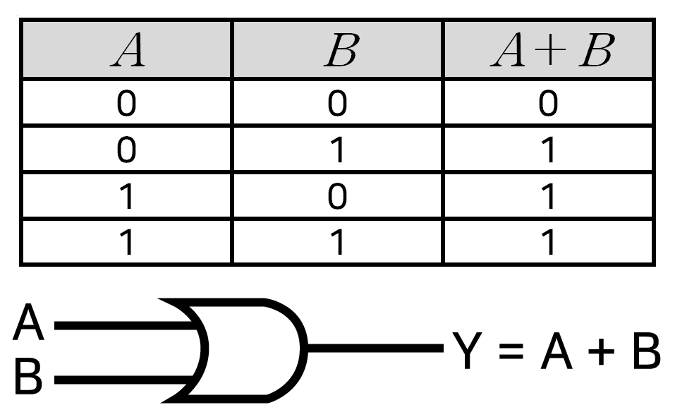

# [CODE] Chapter11 : 빌 게이츠? 논리 게이트! - 2022.03.22

<!-- TOC -->

- [[CODE] Chapter11 : 빌 게이츠? 논리 게이트! - 2022.03.22](#code-chapter11--%EB%B9%8C-%EA%B2%8C%EC%9D%B4%EC%B8%A0-%EB%85%BC%EB%A6%AC-%EA%B2%8C%EC%9D%B4%ED%8A%B8---20220322)
  - [논리 게이트](#%EB%85%BC%EB%A6%AC-%EA%B2%8C%EC%9D%B4%ED%8A%B8)
    - [AND 게이트](#and-%EA%B2%8C%EC%9D%B4%ED%8A%B8)
    - [OR 게이트](#or-%EA%B2%8C%EC%9D%B4%ED%8A%B8)
    - [NOT 게이트](#not-%EA%B2%8C%EC%9D%B4%ED%8A%B8)
    - [버퍼](#%EB%B2%84%ED%8D%BC)
    - [NAND](#nand)
    - [NOR](#nor)
    - [XOR](#xor)
    - [XNOR](#xnor)
    - [논리게이트 동작 영상](#%EB%85%BC%EB%A6%AC%EA%B2%8C%EC%9D%B4%ED%8A%B8-%EB%8F%99%EC%9E%91-%EC%98%81%EC%83%81)
  - [숙고](#%EC%88%99%EA%B3%A0)

<!-- /TOC -->

## `논리 게이트`
- 전자공학에서 논리 회로를 부울 대수를 물리적 작치에 구현한 것으로,  
  하나 이상의 논리적 입력값에 대해 논리 연산을 수행하여  
  하나의 논리적 출력값을 얻는 전자뢰로를 말한다.
### `AND 게이트`
- 둘 다 1 일때 1  
  
### `OR 게이트`
- 하나라도 1 일때, 1
  
### `NOT 게이트`
- 반전
  
### `버퍼`
- 입력 신호 변경 없이 출력
  
### `NAND`
- 둘 다 1 일때 0
  
### `NOR`
- 둘 다 0 일때 1
  
### `XOR`
- 둘 다 다를때 1
  
### `XNOR`
- 둘 다 같을때 1
  

### `논리게이트 동작 영상`
- https://youtu.be/Mci7gysJtI4

## `숙고`
- 참고 : https://diasm3.github.io/wiki/chapter11/

같이 CODE를 읽는 스터디 팀원분의 글을 참고한다.

이 분은 내가 가볍게 지나친 부분 혹은 놓친 부분들에 대해서 잘 짚어서 발표 준비를 해주신다.  
스위치와 릴레이의 차이, 논리게이트를 작성해서 논리회로애서 칩셋을 거쳐 CPU가 만들어지고 컴퓨터의 조립까지.