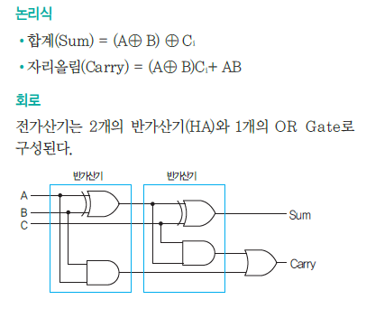

# [CODE] Chapter12 : 이진 덧셈기 - 2022.03.24

<!-- TOC -->

- [[CODE] Chapter12 : 이진 덧셈기 - 2022.03.24](#code-chapter12--%EC%9D%B4%EC%A7%84-%EB%8D%A7%EC%85%88%EA%B8%B0---20220324)
  - [이진수 덧셈기](#%EC%9D%B4%EC%A7%84%EC%88%98-%EB%8D%A7%EC%85%88%EA%B8%B0)
    - [반가산기](#%EB%B0%98%EA%B0%80%EC%82%B0%EA%B8%B0)
    - [전가산기](#%EC%A0%84%EA%B0%80%EC%82%B0%EA%B8%B0)
    - [가산기의 발전](#%EA%B0%80%EC%82%B0%EA%B8%B0%EC%9D%98-%EB%B0%9C%EC%A0%84)
  - [숙고](#%EC%88%99%EA%B3%A0)

<!-- /TOC -->

## `이진수 덧셈기`
- 컴퓨터는 덧셈연산을 통해 뺄셈, 곱셈, 나눗셈이 가능하다.

### `반가산기`
- A, B 두 입력에 대해서 **합은 XOR로 출력**, **자리올림은 AND로 출력**  
- 반가산기는 아랫자리에서 덧셈을 통해 올라온 자리올림의 처리가 불가능하다.  
    
  <table style="border-collapse: collapse; width: 38.1395%; height: 115px;" border="1">
  <tbody>
  <tr style="height: 20px;">
  <td style="width: 50%; height: 20px; text-align: center;" colspan="2"><b>Inputs</b></td>
  <td style="width: 50%; height: 20px; text-align: center;" colspan="2"><b>Outputs</b></td>
  </tr>
  <tr style="height: 20px;">
  <td style="width: 25%; height: 20px; text-align: center;"><b>A</b></td>
  <td style="width: 25%; height: 20px; text-align: center;"><b>B</b></td>
  <td style="width: 25%; height: 20px; text-align: center;"><b>Sum</b></td>
  <td style="width: 25%; height: 20px; text-align: center;"><b>Carry</b></td>
  </tr>
  <tr style="height: 15px;">
  <td style="width: 25%; height: 15px; text-align: center;">0</td>
  <td style="width: 25%; height: 15px; text-align: center;">0</td>
  <td style="width: 25%; height: 15px; text-align: center;">0</td>
  <td style="width: 25%; height: 15px; text-align: center;">0</td>
  </tr>
  <tr style="height: 20px;">
  <td style="width: 25%; height: 20px; text-align: center;">1</td>
  <td style="width: 25%; height: 20px; text-align: center;">0</td>
  <td style="width: 25%; height: 20px; text-align: center;">1</td>
  <td style="width: 25%; height: 20px; text-align: center;">0</td>
  </tr>
  <tr style="height: 20px;">
  <td style="width: 25%; height: 20px; text-align: center;">0</td>
  <td style="width: 25%; height: 20px; text-align: center;">1</td>
  <td style="width: 25%; height: 20px; text-align: center;">1</td>
  <td style="width: 25%; height: 20px; text-align: center;">0</td>
  </tr>
  <tr style="height: 20px;">
  <td style="width: 25%; height: 20px; text-align: center;">1</td>
  <td style="width: 25%; height: 20px; text-align: center;">1</td>
  <td style="width: 25%; height: 20px; text-align: center;">0</td>
  <td style="width: 25%; height: 20px; text-align: center;">1</td>
  </tr>
  </tbody>
  </table>
### `전가산기`
- 반가산기 두 개를 붙여 자리올림을 처리  
  첫번째 반가산기를 통해 윗자리 비트들의 A, B 값을 더한 값에,  
  아랫자리의 자리올림 비트를 더한다.  
    
- 8비트 전가산기를 만들려면 총 144개의 릴레이가 필요하다.  
  전가산기 한 개 = 반가산기 (XOR 6개 + AND 2개) * 2 + OR 2개로 총 18 릴레이 사용  
  18 * 8 = 144 릴레이
  <table style="border-collapse: collapse; width: 50%; height: 180px;" border="1">
  <tbody>
  <tr style="height: 20px;">
  <td style="width: 59.0698%; text-align: center; height: 20px;" colspan="3"><b>Inputs</b></td>
  <td style="width: 40.9302%; text-align: center; height: 20px;" colspan="2"><b>Outputs</b></td>
  </tr>
  <tr style="height: 20px;">
  <td style="width: 20%; text-align: center; height: 20px;"><b>A</b></td>
  <td style="width: 20%; text-align: center; height: 20px;"><b>B</b></td>
  <td style="width: 19.0698%; text-align: center; height: 20px;"><b>Ci</b></td>
  <td style="width: 20.9302%; text-align: center; height: 20px;"><b>Sum</b></td>
  <td style="width: 20%; text-align: center; height: 20px;"><b>Co</b></td>
  </tr>
  <tr style="height: 20px;">
  <td style="width: 20%; height: 20px; text-align: center;">0</td>
  <td style="width: 20%; height: 20px; text-align: center;">0</td>
  <td style="width: 19.0698%; height: 20px; text-align: center;">0</td>
  <td style="width: 20.9302%; height: 20px; text-align: center;">0</td>
  <td style="width: 20%; height: 20px; text-align: center;">0</td>
  </tr>
  <tr style="height: 20px;">
  <td style="width: 20%; height: 20px; text-align: center;">0</td>
  <td style="width: 20%; height: 20px; text-align: center;">1</td>
  <td style="width: 19.0698%; height: 20px; text-align: center;">0</td>
  <td style="width: 20.9302%; height: 20px; text-align: center;">1</td>
  <td style="width: 20%; height: 20px; text-align: center;">0</td>
  </tr>
  <tr style="height: 20px;">
  <td style="width: 20%; height: 20px; text-align: center;">1</td>
  <td style="width: 20%; height: 20px; text-align: center;">0</td>
  <td style="width: 19.0698%; height: 20px; text-align: center;">0</td>
  <td style="width: 20.9302%; height: 20px; text-align: center;">1</td>
  <td style="width: 20%; height: 20px; text-align: center;">0</td>
  </tr>
  <tr style="height: 20px;">
  <td style="width: 20%; height: 20px; text-align: center;">1</td>
  <td style="width: 20%; height: 20px; text-align: center;">1</td>
  <td style="width: 19.0698%; height: 20px; text-align: center;">0</td>
  <td style="width: 20.9302%; height: 20px; text-align: center;">0</td>
  <td style="width: 20%; height: 20px; text-align: center;">1</td>
  </tr>
  <tr style="height: 20px;">
  <td style="width: 20%; height: 20px; text-align: center;">0</td>
  <td style="width: 20%; height: 20px; text-align: center;">0</td>
  <td style="width: 19.0698%; height: 20px; text-align: center;">1</td>
  <td style="width: 20.9302%; height: 20px; text-align: center;">1</td>
  <td style="width: 20%; height: 20px; text-align: center;">0</td>
  </tr>
  <tr style="height: 20px;">
  <td style="width: 20%; height: 20px; text-align: center;">0</td>
  <td style="width: 20%; height: 20px; text-align: center;">1</td>
  <td style="width: 19.0698%; height: 20px; text-align: center;">1</td>
  <td style="width: 20.9302%; height: 20px; text-align: center;">0</td>
  <td style="width: 20%; height: 20px; text-align: center;">1</td>
  </tr>
  <tr style="height: 20px;">
  <td style="width: 20%; height: 20px; text-align: center;">1</td>
  <td style="width: 20%; height: 20px; text-align: center;">0</td>
  <td style="width: 19.0698%; height: 20px; text-align: center;">1</td>
  <td style="width: 20.9302%; height: 20px; text-align: center;">0</td>
  <td style="width: 20%; height: 20px; text-align: center;">1</td>
  </tr>
  <tr>
  <td style="width: 20%; text-align: center;">1</td>
  <td style="width: 20%; text-align: center;">1</td>
  <td style="width: 19.0698%; text-align: center;">1</td>
  <td style="width: 20.9302%; text-align: center;">1</td>
  <td style="width: 20%; text-align: center;">1</td>
  </tr>
  </tbody>
  </table>
### `가산기의 발전`
- 책에 나온 가산기는 가장 아랫자리의 수를 더해서 만들어지는 그 다음 자리 덧셈을 할 때 입력 되어야 하며, 이는 계속 반복된다.  
  따라서 이 가산기의 속도는 전가산기의 처리 속도와 비트 수를 곱한 결과이다.
  실제 가산기들은 자리 올림을 예상하는 기능을 수행하는 추가 회로를 이용하여  
  가산 속도를 높인다.
- 실제 사용되는 가산기들은 릴레이를 사용하지 않고 진공관을 사용했으며,  
  오늘날의 컴퓨터는 트랜지스터를 사용한다.  
  트랜지스터는 릴레이와 같은 동작을 하지만,  
  비교하기 어려울 정도로 빠르며, 작고, 조용하며, 저렴하다.
  8비트 가산기를 만들려면 여전히 144개의 트랜지스터가 필요한 것은 동일하다.

## `숙고`
와.. 전문대 다닐 시절 컴퓨터 구조에서 배운 반가산기와 전가산기가 이제서야 이해가 됐다..  
XOR를 통해서 자리 올림을 구현한 것과 반가산기 두 개를 통해 전가산기를 만듦으로써 자리올림에 대한 처리를 구현한 것이 놀랍다.