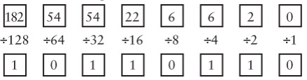
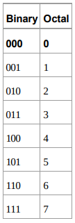
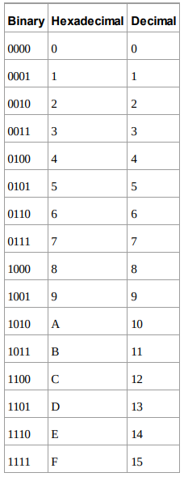

# [CODE] Chapter15 : 바이트와 16진수 - 2022.03.29

<!-- TOC -->

- [[CODE] Chapter15 : 바이트와 16진수 - 2022.03.29](#code-chapter15--%EB%B0%94%EC%9D%B4%ED%8A%B8%EC%99%80-16%EC%A7%84%EC%88%98---20220329)
  - [Byte](#byte)
    - [BCD 코드](#bcd-%EC%BD%94%EB%93%9C)
    - [Byte로 보는 단위](#byte%EB%A1%9C-%EB%B3%B4%EB%8A%94-%EB%8B%A8%EC%9C%84)
    - [진법 변환](#%EC%A7%84%EB%B2%95-%EB%B3%80%ED%99%98)
      - [2진수를 10진수로](#2%EC%A7%84%EC%88%98%EB%A5%BC-10%EC%A7%84%EC%88%98%EB%A1%9C)
      - [10진수를 2진수로](#10%EC%A7%84%EC%88%98%EB%A5%BC-2%EC%A7%84%EC%88%98%EB%A1%9C)
      - [2진수 <=> 8진수](#2%EC%A7%84%EC%88%98--8%EC%A7%84%EC%88%98)
  - [16진수](#16%EC%A7%84%EC%88%98)
  - [숙고](#%EC%88%99%EA%B3%A0)

<!-- /TOC -->

## `Byte`
- 8 bit를 묶은 단위
- 기본적으로 Byte는 8 bit를 묶어서 가리키는 단어는 octet이며  
  byte는 문자 1개를 표시하기 위해 사용되었다.
- 1956년 경 IBM에서 만들어진 단어로, BCD라 불리는 숫자 표시 형식을 저장하기에 편리하고,  
  서구권에서는 문자를 저장하는데 8 bit는 적당한 크기이기에,  
  byte는 컴퓨터가 조작하는 정보의 최소 처리 단위가 되었고  
  1octet = 1byte로 굳어졌다.  
  (bit는 0, 1뿐이라 일정한 단위로 묶인 byte를 정보 표현의 기본 단위로 삼는다.)

### `BCD 코드`
- Binary Coded Decimal  
  이진수 네 자리를 묶어서 십진수 한자리로 사용하는 기수법

### `Byte로 보는 단위`
<table class="txc-table" width="784" cellspacing="0" cellpadding="0" border="0" style="border:none;border-collapse:collapse;;font-family:" 맑은="" 고딕",="" sans-serif;font-size:13px"=""><tbody><tr><td style="width: 200px; height: 24px; border-width: 1px; border-style: solid; border-color: rgb(204, 204, 204);">
&nbsp; 비트(bit)
</td>
<td style="width: 583px; height: 24px; border-bottom: 1px solid rgb(204, 204, 204); border-right: 1px solid rgb(204, 204, 204); border-top: 1px solid rgb(204, 204, 204);">
&nbsp;binary digit의 약자. 데이터 구성의 최소 단위. 0과 1로 이루어짐&nbsp;
</td>
</tr>
<tr><td style="width: 200px; height: 24px; border-bottom: 1px solid rgb(204, 204, 204); border-right: 1px solid rgb(204, 204, 204); border-left: 1px solid rgb(204, 204, 204);">
&nbsp; 쿼터(quarter)
</td>
<td style="width: 583px; height: 24px; border-bottom: 1px solid rgb(204, 204, 204); border-right: 1px solid rgb(204, 204, 204);">
&nbsp;1/4 바이트&nbsp;(2 비트)&nbsp;
</td>
</tr>
<tr><td style="width: 200px; height: 24px; border-bottom: 1px solid rgb(204, 204, 204); border-right: 1px solid rgb(204, 204, 204); border-left: 1px solid rgb(204, 204, 204);">
&nbsp; 니블(nibble)&nbsp;
</td>
<td style="width: 583px; height: 24px; border-bottom: 1px solid rgb(204, 204, 204); border-right: 1px solid rgb(204, 204, 204);">
&nbsp;1/2 바이트&nbsp;(4 비트)&nbsp;
</td>
</tr>
<tr><td style="width: 200px; height: 24px; border-bottom: 1px solid rgb(204, 204, 204); border-right: 1px solid rgb(204, 204, 204); border-left: 1px solid rgb(204, 204, 204);">
&nbsp; 바이트(byte)
</td>
<td style="width: 583px; height: 24px; border-bottom: 1px solid rgb(204, 204, 204); border-right: 1px solid rgb(204, 204, 204);">
&nbsp;1 바이트&nbsp;(8 비트)&nbsp;
</td>
</tr>
<tr><td style="width: 200px; height: 24px; border-bottom: 1px solid rgb(204, 204, 204); border-right: 1px solid rgb(204, 204, 204); border-left: 1px solid rgb(204, 204, 204);">
&nbsp; 워드(word)&nbsp;
</td>
<td style="width: 583px; height: 24px; border-bottom: 1px solid rgb(204, 204, 204); border-right: 1px solid rgb(204, 204, 204);">
&nbsp;2 바이트 (16 비트)&nbsp;
</td>
</tr>
<tr><td style="width: 200px; height: 24px; border-bottom: 1px solid rgb(204, 204, 204); border-right: 1px solid rgb(204, 204, 204); border-left: 1px solid rgb(204, 204, 204);">
&nbsp; 더블 워드(double word)
</td>
<td style="width: 583px; height: 24px; border-bottom: 1px solid rgb(204, 204, 204); border-right: 1px solid rgb(204, 204, 204);">
&nbsp;4 바이트 (32 비트)&nbsp;
</td>
</tr>
<tr><td style="width: 200px; height: 24px; border-bottom: 1px solid rgb(204, 204, 204); border-right: 1px solid rgb(204, 204, 204); border-left: 1px solid rgb(204, 204, 204);">
&nbsp; 쿼드 워드(quad word)
</td>
<td style="width: 583px; height: 24px; border-bottom: 1px solid rgb(204, 204, 204); border-right: 1px solid rgb(204, 204, 204);">
&nbsp;8 바이트 (64 비트)&nbsp;
</td>
</tr>
<tr><td style="width: 200px; height: 24px; border-bottom: 1px solid rgb(204, 204, 204); border-right: 1px solid rgb(204, 204, 204); border-left: 1px solid rgb(204, 204, 204);">
&nbsp; Kilobyte (KB)

&nbsp; Megabyte (MB)

&nbsp; Gigabyte (GB)

&nbsp; Terabyte (TB)

&nbsp; Petabyte (PB)

&nbsp; Exabyte (EB)

&nbsp; Zettabyte (ZB)

&nbsp; Yottabyte (YB)
</td>
<td style="width: 583px; height: 24px; border-bottom: 1px solid rgb(204, 204, 204); border-right: 1px solid rgb(204, 204, 204);">
&nbsp;2^10 바이트

&nbsp;2^20 바이트

&nbsp;2^30 바이트

&nbsp;2^40 바이트

&nbsp;2^50 바이트

&nbsp;2^60 바이트

&nbsp;2^70 바이트

&nbsp;2^80 바이트&nbsp;
</td>
</tr>
</tbody></table>

### `진법 변환`
#### `2진수를 10진수로` 

#### `10진수를 2진수로` 

#### `2진수 <=> 8진수`
- 1개를 3개로 분리, 3개를 1개로 합체  
  

## `16진수`
- 10진수를 넘어가는 수체계로,  
  10부터 15까지를 표현하기 위해 알파벳의 처음 여섯 문자를 사용한다.  
  

## `숙고`
처음에는 8비트를 가지고 최소 정보단위로 하였으나 정보의 양이 점점 늘어남에 따라  
16비트로 데이터를 표현하게 된 것도 재밌고,  
8비트나 16비트 모두 딱 떨어지게 2비트(혹은 4비트)로 나누게 된 것도 흥미롭다.