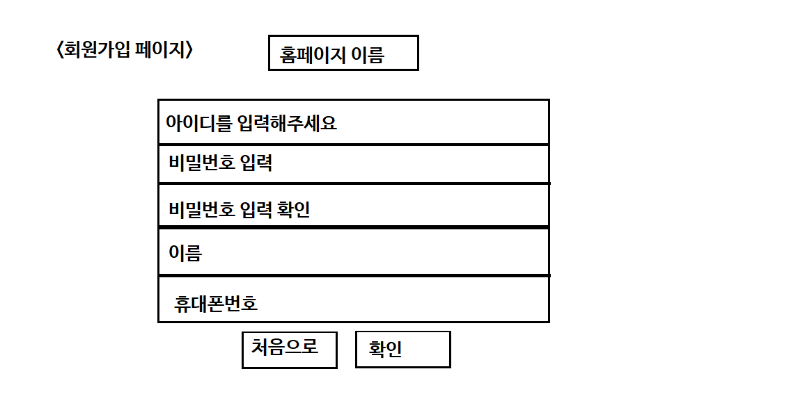
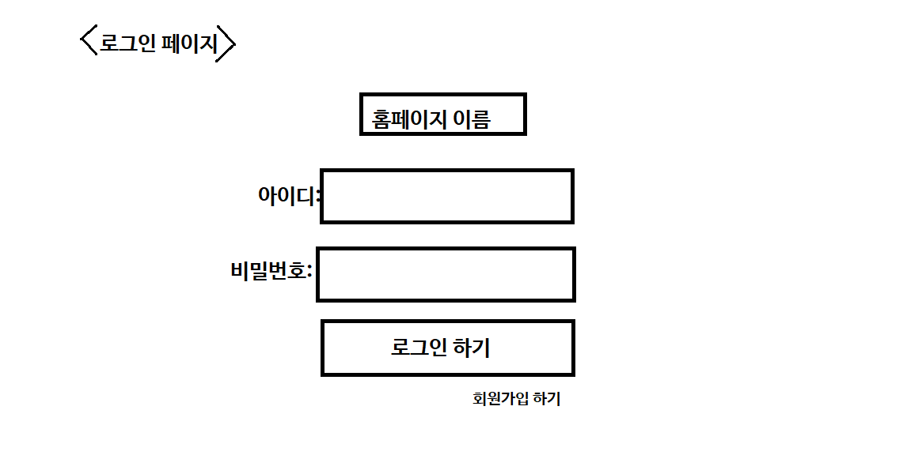
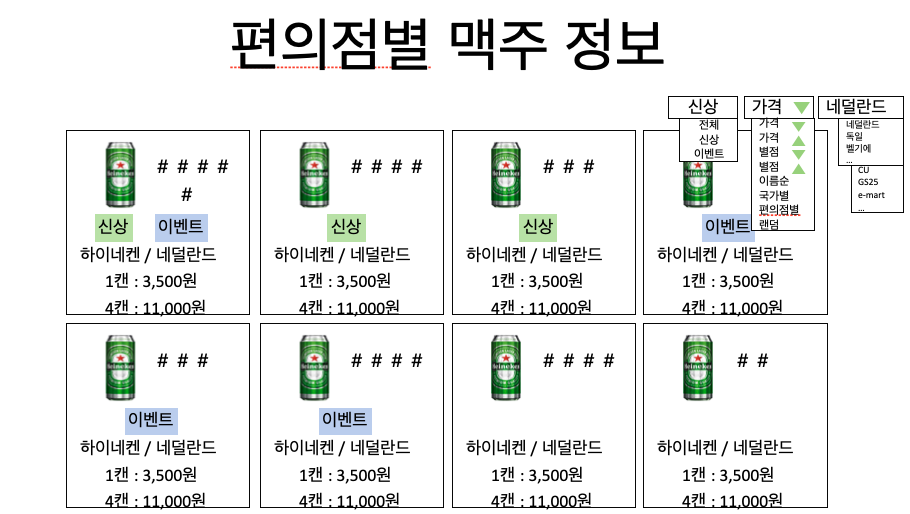
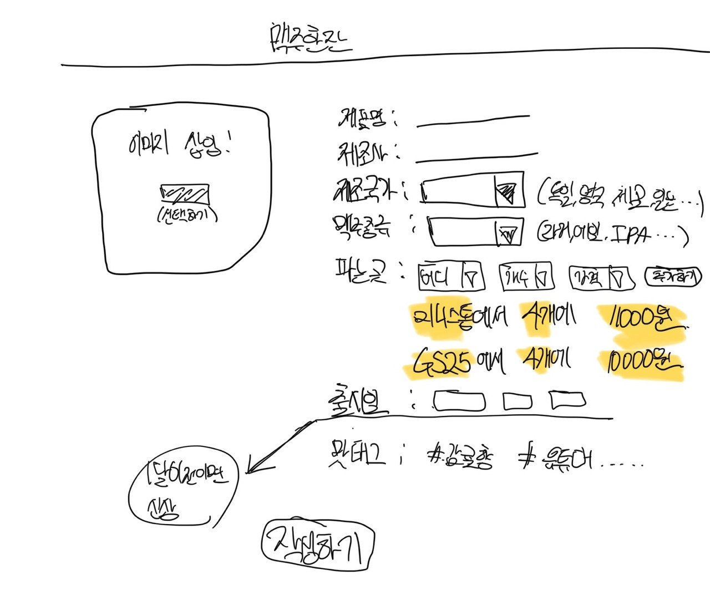
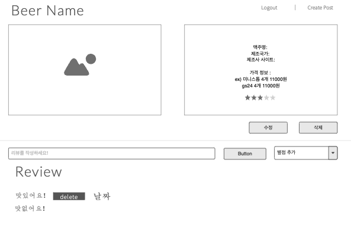

# [항해99 6기] 웹미니 프로젝트 주간(1) - 2022.03.07

<!-- TOC -->

- [[항해99 6기] 웹미니 프로젝트 주간1 - 2022.03.07](#%ED%95%AD%ED%95%B499-6%EA%B8%B0-%EC%9B%B9%EB%AF%B8%EB%8B%88-%ED%94%84%EB%A1%9C%EC%A0%9D%ED%8A%B8-%EC%A3%BC%EA%B0%841---20220307)
- [Learned](#learned)
  - [Starting Assignment](#starting-assignment)
    - [프로젝트 명](#%ED%94%84%EB%A1%9C%EC%A0%9D%ED%8A%B8-%EB%AA%85)
    - [와이어프레임](#%EC%99%80%EC%9D%B4%EC%96%B4%ED%94%84%EB%A0%88%EC%9E%84)
    - [개발해야 하는 기능들](#%EA%B0%9C%EB%B0%9C%ED%95%B4%EC%95%BC-%ED%95%98%EB%8A%94-%EA%B8%B0%EB%8A%A5%EB%93%A4)
    - [public github repo 주소](#public-github-repo-%EC%A3%BC%EC%86%8C)
- [Will learn](#will-learn)
- [Retrospect](#retrospect)

<!-- /TOC -->

# Learned
- 브레인 스토밍을 통한 주제 선정
- 프로젝트 S.A(Starting Assignment) 제출
- 프로젝트 틀 구성

## Starting Assignment 

### 프로젝트 명
- 캔을 Beer : 편의점 맥주 종류를 한 눈에 볼 수 있고 리뷰와 별점 등을 매길 수 있는 맥주 정보 커뮤니티

### 와이어프레임
1. 회원가입 페이지  

2. 로그인 페이지  

3. 메인 페이지  

4. 상품 등록 페이지  

5. 상품 상세 페이지  

### 개발해야 하는 기능들
1. 회원가입 / 로그인
    <table class="table table-bordered">
      <thead class="thead-light">
        <tr>
          <th>기능</th>
          <th>Method</th>
          <th>URL</th>
          <th>request</th>
          <th>response</th>
        </tr>
      </thead>
      <tbody>
        <tr>
          <td>회원가입</td>
          <td>POST</td>
          <td>/signup</td>
          <td>{'id':id, 'pw':pw, 'name':name, 'phone':phone}</td>
          <td>{'msg': '회원가입이 완료되었습니다.'}</td>
        </tr>
        <tr>
          <td>로그인</td>
          <td>POST</td>
          <td>/login</td>
          <td>{'id': insert_id, 'pw': insert_pw}</td>
          <td>로그인 성공 - {'result': 'success', 'token': token}, 로그인 실패 - {'result': 'fail', 'msg': '로그인 실패'}</td>
        </tr>
      </tbody>
    </table>
2. 메인 페이지
    <table class="table table-bordered">
      <thead class="thead-light">
        <tr>
          <th>기능</th>
          <th>Method</th>
          <th>URL</th>
          <th>request</th>
          <th>response</th>
        </tr>
      </thead>
      <tbody>
        <tr>
          <td>메인화면 페이지 로드	</td>
          <td>GET</td>
          <td>/</td>
          <td>sort_type</td>
          <td>render_template('index.html')</td>
        </tr>
      </tbody>
    </table>
3. 상품 등록 페이지
    <table class="table table-bordered">
      <thead class="thead-light">
        <tr>
          <th>기능</th>
          <th>Method</th>
          <th>URL</th>
          <th>request</th>
          <th>response</th>
        </tr>
      </thead>
      <tbody>
        <tr>
          <td>상품 등록</td>
          <td>POST</td>
          <td>/api/writing</td>
          <td>{'writer_name': writer_name, 'beer_name': beer_name, 'beer_country': beer_country, 'beer_type': beer_type, 'beer_where':beer_where, 'beer_when' : beer_when, 'beer_img': beer_img}</td>
          <td>Token 검증됨 - {'msg': '저장되었습니다.'} Token 검증 안됨 - url_for("login", msg="로그인 정보가 존재하지 않습니다.")</td>
        </tr>
      </tbody>
    </table>
4. 상품 상세 페이지
    <table class="table table-bordered">
      <thead class="thead-light">
        <tr>
          <th>기능</th>
          <th>Method</th>
          <th>URL</th>
          <th>request</th>
          <th>response</th>
        </tr>
      </thead>
      <tbody>
        <tr>
          <td>상품 상세 페이지 로드</td>
          <td>GET</td>
          <td>/detail/:product_id	</td>
          <td>{ 'product_id' : 'product_id' }</td>
          <td>render(detail.html)</td>
        </tr>
        <tr>
          <td>리뷰 작성</td>
          <td>POST</td>
          <td>/review/:product_id</td>
          <td>{ 'product_id' : 'product_id' }</td>
          <td>render(detail.html)</td>
        </tr>
        <tr>
          <td>리뷰 삭제</td>
          <td>DELETE</td>
          <td>/review/:review_id</td>
          <td>{ 'product_id' : 'product_id' , 'review_id' : 'review_id' }</td>
          <td>render(detail.html)</td>
        </tr>
      </tbody>
    </table>

### public github repo 주소
https://github.com/moto4321/can-beer-project

# Will learn
- 메인 페이지 작성

# Retrospect
오전에 OT를 시작으로 정신없이 하루가 지나갔다.  

팀원들이랑은 전날 만나서 게더서비스를 통해서 인사 미션(?)을 수행하였고  
오늘부터 나흘이라는 짧은 시간동안 미니 프로젝트를 진행하게 되었다.  

각자 페이지를 하나씩 맡아서 진행하게 되었고  
나는 메인 페이지를 맡게 되었다.

메인 페이지의 작업할 양이 너무 적을거 같아서 정렬 기능 추가 의견을 냈다.

3개월, 몰입하기에 가장 좋은 기간같다.  
경력자이지만 초심으로 돌아가 모든 것에 궁금해하고 공부하고 기록하자.