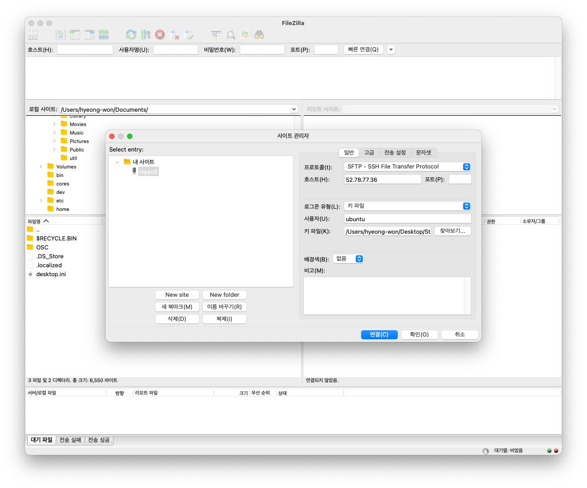
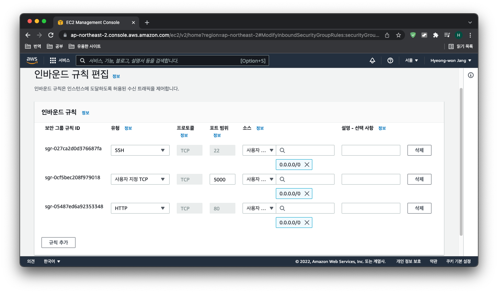

# [항해99 6기] 웹미니 프로젝트 주간(4) - 2022.03.10

<!-- TOC -->

- [[항해99 6기] 웹미니 프로젝트 주간4 - 2022.03.10](#%ED%95%AD%ED%95%B499-6%EA%B8%B0-%EC%9B%B9%EB%AF%B8%EB%8B%88-%ED%94%84%EB%A1%9C%EC%A0%9D%ED%8A%B8-%EC%A3%BC%EA%B0%844---20220310)
- [Learned](#learned)
  - [AWS EC2 배포](#aws-ec2-%EB%B0%B0%ED%8F%AC)
    - [AWS EC2 접속](#aws-ec2-%EC%A0%91%EC%86%8D)
    - [서버 세팅](#%EC%84%9C%EB%B2%84-%EC%84%B8%ED%8C%85)
    - [파일질라 접속](#%ED%8C%8C%EC%9D%BC%EC%A7%88%EB%9D%BC-%EC%A0%91%EC%86%8D)
    - [패키지 설치](#%ED%8C%A8%ED%82%A4%EC%A7%80-%EC%84%A4%EC%B9%98)
    - [EC2 포트 오픈](#ec2-%ED%8F%AC%ED%8A%B8-%EC%98%A4%ED%94%88)
    - [nohup 설정](#nohup-%EC%84%A4%EC%A0%95)
- [Will learn](#will-learn)
- [Retrospect](#retrospect)

<!-- /TOC -->

# Learned
- AWS EC2 배포

## AWS EC2 배포

### AWS EC2 접속
Mac OS 기준
- 터미널을 열기
- AWS Keypair의 접근 권한을 바꿔주기
```bash
sudo chmod 400 받은키페어를끌어다놓기 
```
- SSH로 접속하기
```bash
ssh -i 받은키페어를끌어다놓기 ubuntu@AWS에적힌내아이피
```

### 서버 세팅

```bash
# python3 명령어를 python 명령어로 대신 사용하도록 변경
sudo update-alternatives --install /usr/bin/python python /usr/bin/python3 10

# pip3 설치 후 pip 명령어로 대신 사용하도록 설정
sudo apt-get update
sudo apt-get install -y python3-pip
sudo update-alternatives --install /usr/bin/pip pip /usr/bin/pip3 1

# port forwarding
sudo iptables -t nat -A PREROUTING -i eth0 -p tcp --dport 80 -j REDIRECT --to-port 5000
```
### 파일질라 접속
파일질라 접속 정보를 아래와 같이 입력한다


### 패키지 설치
```bash
pip install flask pymongo dnspython certifi PyJWT

```
### EC2 포트 오픈
보안 그룹에서 5000, 80 포트 오픈


### nohup 설정
프로그램이 서버 백그라운드에서 계속 돌아가도록 실행
```bash
nohup python app.py &
```
프로그램 종료방법
```jsx
ps -ef | grep 'python app.py' | awk '{print $2}' | xargs kill
```

# Will learn
- Postman
- Insomnia

# Retrospect
4일 이라는 시간이 너무 빨리 지나갔다.  
꼰머로 보일까 두려워 팀원들이 먼저 물어보지 않는 한 코드에 관여하지 않았다.  
그래서 프로젝트 구현은 됐으나 좀 삐걱거리면서 동작하는게 마음에 걸린다.  
내걸로 당겨왔으니 시간적 여유가 생겼을때 잊지말고 개선하고자 한다.  

프로젝트의 회고 멘토링을 진행하던중 막혔던 부분에서  
Postman과 Insomnia로 테스트를 해보았냐는 질문에 머리가 새하얘졌다.  
~~Postman은 내 PC에도 설치가 되어 있지 않은가..~~

개발을 너무 멀리하고 살았나 싶어서 지난날을 반성하는 밤이다.