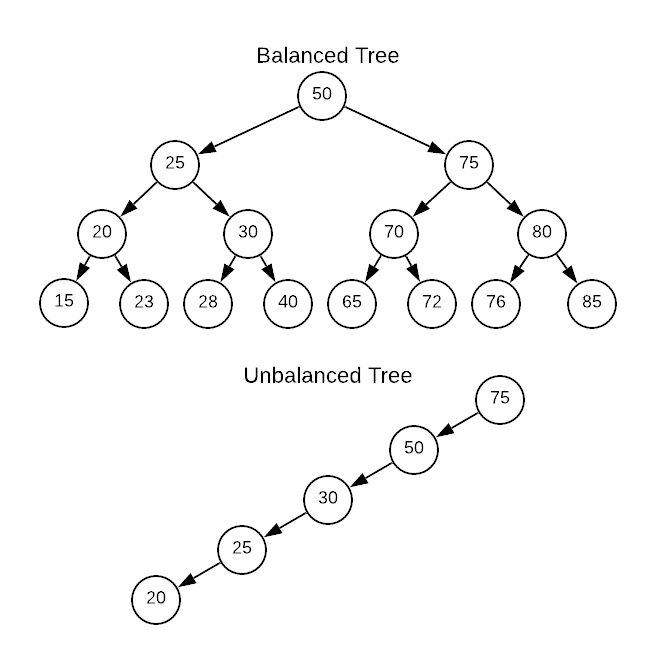

# [항해99 6기] 알고리즘 주간(13) - 2022.03.23

<!-- TOC -->

- [[항해99 6기] 알고리즘 주간13 - 2022.03.23](#%ED%95%AD%ED%95%B499-6%EA%B8%B0-%EC%95%8C%EA%B3%A0%EB%A6%AC%EC%A6%98-%EC%A3%BC%EA%B0%8413---20220323)
- [Learned](#learned)
  - [이진 트리](#%EC%9D%B4%EC%A7%84-%ED%8A%B8%EB%A6%AC)
    - [이진 탬색 트리](#%EC%9D%B4%EC%A7%84-%ED%83%AC%EC%83%89-%ED%8A%B8%EB%A6%AC)
  - [정렬된 배열의 이진 탐색 트리 변환 - 더 공부하기](#%EC%A0%95%EB%A0%AC%EB%90%9C-%EB%B0%B0%EC%97%B4%EC%9D%98-%EC%9D%B4%EC%A7%84-%ED%83%90%EC%83%89-%ED%8A%B8%EB%A6%AC-%EB%B3%80%ED%99%98---%EB%8D%94-%EA%B3%B5%EB%B6%80%ED%95%98%EA%B8%B0)
  - [두 이진 트리 병합](#%EB%91%90-%EC%9D%B4%EC%A7%84-%ED%8A%B8%EB%A6%AC-%EB%B3%91%ED%95%A9)
  - [이진 트리 직렬화 & 역직렬화](#%EC%9D%B4%EC%A7%84-%ED%8A%B8%EB%A6%AC-%EC%A7%81%EB%A0%AC%ED%99%94--%EC%97%AD%EC%A7%81%EB%A0%AC%ED%99%94)
  - [균형 이진 트리 - 더 공부하기](#%EA%B7%A0%ED%98%95-%EC%9D%B4%EC%A7%84-%ED%8A%B8%EB%A6%AC---%EB%8D%94-%EA%B3%B5%EB%B6%80%ED%95%98%EA%B8%B0)
  - [최소 높이 트리 - 더 공부하기](#%EC%B5%9C%EC%86%8C-%EB%86%92%EC%9D%B4-%ED%8A%B8%EB%A6%AC---%EB%8D%94-%EA%B3%B5%EB%B6%80%ED%95%98%EA%B8%B0)
  - [[boj]트리 - 더 공부하기](#boj%ED%8A%B8%EB%A6%AC---%EB%8D%94-%EA%B3%B5%EB%B6%80%ED%95%98%EA%B8%B0)
- [Retrospect](#retrospect)

<!-- /TOC -->

# Learned
- 이진 트리
- 정렬된 배열의 이진 탐색 트리 변환 
- 두 이진 트리 병합
- 이진 트리 직렬화 & 역직렬화
- 균형 이진 트리
- 최소 높이 트리
- [boj]트리

## 이진 트리
### 이진 탬색 트리
- 부모 기준으로 왼쪽에는 작은 값, 오른쪽에는 큰 값이 오는 트리  
- 평균적으로 탐색의 시간복잡도는 O(logN), 치우친 경우 O(N)

## 정렬된 배열의 이진 탐색 트리 변환 - 더 공부하기
- 문제 : https://leetcode.com/problems/convert-sorted-array-to-binary-search-tree/
- 풀이 : https://github.com/yogoloper/TIL/blob/master/Algorithm/algorithm-interview/14_50_convert-sorted-array-to-binary-search-tree.md 

## 두 이진 트리 병합
- 문제 : https://leetcode.com/problems/merge-two-binary-trees/
- 풀이 : https://github.com/yogoloper/TIL/blob/master/Algorithm/algorithm-interview/14_46_merge-two-binary-trees.md 

## 이진 트리 직렬화 & 역직렬화
- 문제 : https://leetcode.com/problems/serialize-and-deserialize-binary-tree/
- 풀이 : https://github.com/yogoloper/TIL/blob/master/Algorithm/algorithm-interview/14_47_serialize-and-deserialize-binary-tree.md 

## 균형 이진 트리 - 더 공부하기
- 문제 : https://leetcode.com/problems/balanced-binary-tree/
- 풀이 : https://github.com/yogoloper/TIL/blob/master/Algorithm/algorithm-interview/14_48_balanced-binary-tree.md 

## 최소 높이 트리 - 더 공부하기
- 문제 : https://leetcode.com/problems/minimum-height-trees/
- 풀이 : https://github.com/yogoloper/TIL/blob/master/Algorithm/algorithm-interview/14_49_minimum-height-trees.md 

## [boj]트리 - 더 공부하기
- 문제 : https://www.acmicpc.net/problem/1068
- 풀이 : https://github.com/yogoloper/TIL/blob/master/Algorithm/Baekjoon-Online-Judge/1068.md  

# Retrospect
알고리즘을 오늘까지 했는데 힘든 내용은 거의 끝난것 같다..  
이제는 어떻게 풀어야 겠다는 컨셉을 어떻게든 잡을 수 있게 된 것 같다.