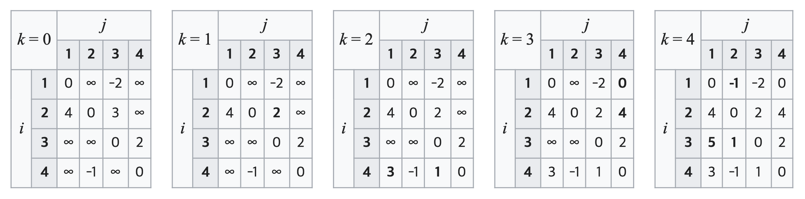
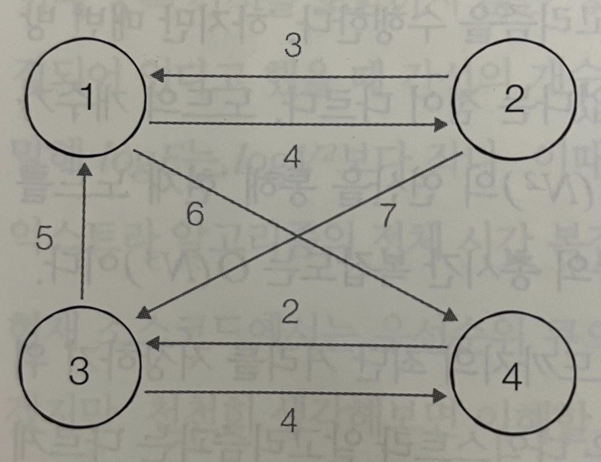

# [항해99 6기] 알고리즘 주간(25) - 2022.04.04

<!-- TOC -->

- [[항해99 6기] 알고리즘 주간25 - 2022.04.04](#%ED%95%AD%ED%95%B499-6%EA%B8%B0-%EC%95%8C%EA%B3%A0%EB%A6%AC%EC%A6%98-%EC%A3%BC%EA%B0%8425---20220404)
- [Learned](#learned)
  - [최단 경로](#%EC%B5%9C%EB%8B%A8-%EA%B2%BD%EB%A1%9C)
  - [플로이드-워셜](#%ED%94%8C%EB%A1%9C%EC%9D%B4%EB%93%9C-%EC%9B%8C%EC%85%9C)
    - [구현](#%EA%B5%AC%ED%98%84)
      - [구현 1](#%EA%B5%AC%ED%98%84-1)
  - [[이코테]플로이드 - 더 공부하기](#%EC%9D%B4%EC%BD%94%ED%85%8C%ED%94%8C%EB%A1%9C%EC%9D%B4%EB%93%9C---%EB%8D%94-%EA%B3%B5%EB%B6%80%ED%95%98%EA%B8%B0)
  - [[이코테]정확한 순위 - 더 공부하기](#%EC%9D%B4%EC%BD%94%ED%85%8C%EC%A0%95%ED%99%95%ED%95%9C-%EC%88%9C%EC%9C%84---%EB%8D%94-%EA%B3%B5%EB%B6%80%ED%95%98%EA%B8%B0)
  - [[이코테]전보- 더 공부하기](#%EC%9D%B4%EC%BD%94%ED%85%8C%EC%A0%84%EB%B3%B4--%EB%8D%94-%EA%B3%B5%EB%B6%80%ED%95%98%EA%B8%B0)
  - [[boj]녹색 옷 입은 애가 젤다지? - 더 공부하기](#boj%EB%85%B9%EC%83%89-%EC%98%B7-%EC%9E%85%EC%9D%80-%EC%95%A0%EA%B0%80-%EC%A0%A4%EB%8B%A4%EC%A7%80---%EB%8D%94-%EA%B3%B5%EB%B6%80%ED%95%98%EA%B8%B0)
  - [[boj]운동 - 더 공부하기](#boj%EC%9A%B4%EB%8F%99---%EB%8D%94-%EA%B3%B5%EB%B6%80%ED%95%98%EA%B8%B0)
- [Retrospect](#retrospect)

<!-- /TOC -->

# Learned
- 최단 경로
- 플로이드-워셜
- [이코테]플로이드
- [이코테]정확한 순위
- [이코테]전보
- [boj]녹색 옷 입은 애가 젤다지?
- [boj]운동

## 최단 경로
- 그래프로 표현, 각 지점은 노드, 도로는 간선  
- 다익스트라, 플로이드-위셜을 통해 해결

## 플로이드-워셜
- 다익스트라 : 출발점을 정했을 때 다른 노드에 이르는 최단거리.
- 플로이드-워셜 : 모든 지점에서 다른 모든 지점까지 최단거리.  
  $D_{ab} = min(D_{ab}, D_{ak} + D_{kb})$  
  -> a에서 b로, a에서 k거쳐서 b로 가는 것중의 최소값  
  자기자신으로 가는 비용은 0  
  직접 연결되어있지 않은 경로는 무한대.  

<div style="background-color: white;">
<image src="./images/Hanghae_day29_Algorithm_01.png">
</div>




### 구현

``` python
// testcase.txt

4
7
1 2 4
1 4 6
2 1 3
2 3 7
3 1 5
3 4 4
4 3 2
```

#### 구현 1
``` python
from collections import defaultdict
from pprint import pprint

INF = int(1e9)

def floyd_warshall(graph):
    n = len(graph)
    dist = [[INF] * ( n + 1) for _ in range(n + 1)]

    for idx in range(1, n + 1):
        dist[idx][idx] = 0
    for start, adjs in graph.items():
        for adj, d in adjs:
            dist[start][adj] = d

    for k in range(1, n + 1):
        for a in range(1, n + 1):
            for b in range(1, n + 1):
                dist[a][b] = min(dist[a][b], dist[a][k] + dist[k][b])

    return dist

n = int(input())
m = int(input())
graph = defaultdict(list)
for _ in range(m):
    a, b, c = map(int, input().split())
    graph[a].append((b, c))

pprint(floyd_warshall(graph))
```

## [이코테]플로이드 - 더 공부하기
- 풀이 : https://github.com/yogoloper/TIL/blob/master/Algorithm/pyhon-for-coding-test/17_37.md  

## [이코테]정확한 순위 - 더 공부하기
- 풀이 : https://github.com/yogoloper/TIL/blob/master/Algorithm/pyhon-for-coding-test/17_38.md  

## [이코테]전보- 더 공부하기
- 풀이 : https://github.com/yogoloper/TIL/blob/master/Algorithm/pyhon-for-coding-test/09_03.md  

## [boj]녹색 옷 입은 애가 젤다지? - 더 공부하기
- 문제 : https://www.acmicpc.net/problem/4485
- 풀이 : https://github.com/yogoloper/TIL/blob/master/Algorithm/Baekjoon-Online-Judge/4485.md  

## [boj]운동 - 더 공부하기
- 문제 : https://www.acmicpc.net/problem/1956
- 풀이 : https://github.com/yogoloper/TIL/blob/master/Algorithm/Baekjoon-Online-Judge/1956.md  

# Retrospect
플로이드-워셜도 학부때 다뤘던가..  
다익스트라보다 쉬운것같지만 3중 반복문이 헷갈리긴 마찬가지이다.  
다익스트라는 출발점이 있을때 사용,  
플로이드-워셜은 출발점이 정해져있지 않을때 모든 노드에서 출발할떄 사용.