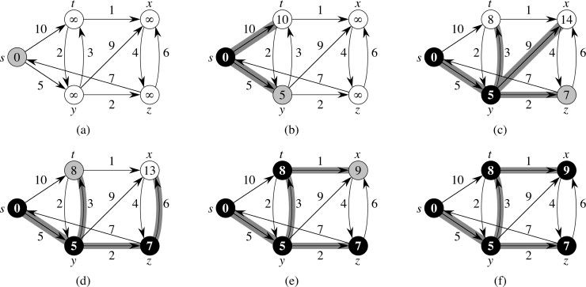
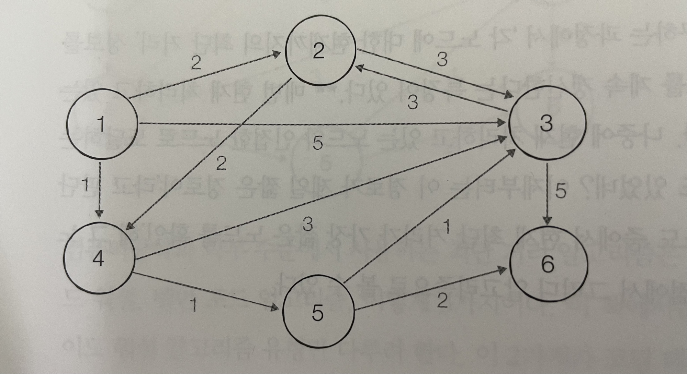
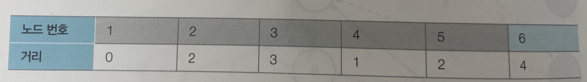

# [항해99 6기] 알고리즘 주간(25) - 2022.04.03

<!-- TOC -->

- [[항해99 6기] 알고리즘 주간24 - 2022.04.03](#%ED%95%AD%ED%95%B499-6%EA%B8%B0-%EC%95%8C%EA%B3%A0%EB%A6%AC%EC%A6%98-%EC%A3%BC%EA%B0%8424---20220403)
- [Learned](#learned)
  - [최단 경로](#%EC%B5%9C%EB%8B%A8-%EA%B2%BD%EB%A1%9C)
  - [다익스트라](#%EB%8B%A4%EC%9D%B5%EC%8A%A4%ED%8A%B8%EB%9D%BC)
    - [구현](#%EA%B5%AC%ED%98%84)
      - [구현 1](#%EA%B5%AC%ED%98%84-1)
      - [구현 2](#%EA%B5%AC%ED%98%84-2)
  - [[이코테]화성 탐사 - 더 공부하기](#%EC%9D%B4%EC%BD%94%ED%85%8C%ED%99%94%EC%84%B1-%ED%83%90%EC%82%AC---%EB%8D%94-%EA%B3%B5%EB%B6%80%ED%95%98%EA%B8%B0)
  - [[이코테]숨바꼭질 - 더 공부하기](#%EC%9D%B4%EC%BD%94%ED%85%8C%EC%88%A8%EB%B0%94%EA%BC%AD%EC%A7%88---%EB%8D%94-%EA%B3%B5%EB%B6%80%ED%95%98%EA%B8%B0)
  - [[이코테]가장 빠른 길 찾기 - 더 공부하기](#%EC%9D%B4%EC%BD%94%ED%85%8C%EA%B0%80%EC%9E%A5-%EB%B9%A0%EB%A5%B8-%EA%B8%B8-%EC%B0%BE%EA%B8%B0---%EB%8D%94-%EA%B3%B5%EB%B6%80%ED%95%98%EA%B8%B0)
  - [[이코테]미래 도시 - 더 공부하기](#%EC%9D%B4%EC%BD%94%ED%85%8C%EB%AF%B8%EB%9E%98-%EB%8F%84%EC%8B%9C---%EB%8D%94-%EA%B3%B5%EB%B6%80%ED%95%98%EA%B8%B0)
- [Retrospect](#retrospect)

<!-- /TOC -->

# Learned
- 최단 경로
- 다익스트라
- [이코테]화성 탐사
- [이코테]숨바꼭질
- [이코테]가장 빠른 길 찾기
- [이코테]미래 도시

## 최단 경로
- 그래프로 표현, 각 지점은 노드, 도로는 간선  
- 다익스트라, 플로이드-위셜을 통해 해결

## 다익스트라
- 출발점이 고정된 상태에서 도로 교통망 같은 곳에서 나타날 수 있는 그래프에서 꼭짓점 간의 최단 경로를 찾는 알고리즘



``` python
1. 출발지를 s로 정하고, 다음과 같이 표시한다.
      (s,    t,     x,     y,     z  순)
거리 = [0,    inf,   inf,   inf,   inf]
방문 = [True, False, False, False, False]

2. 갈 수 있는 노드들의 최소거리를 측정한다.
s->t: 10
s->y: 5
      (s,    t,     x,     y,     z  순)
거리 = [0,    10,    inf,   5,     inf]
방문 = [True, False, False, False, False]

3. 방문 안한 녀석들 중 가장 가까운 녀석인 y를 방문하고, 최소거리를 측정한다.
y->t: 3
y->x: 9
y->z: 2
      (s,    t,     x,     y,    z  순)
거리 = [0,    8,     14,    5,    7]
방문 = [True, False, False, True, False]

4. 방문 안한 녀석들 중 가장 가까운 녀석인 z를 방문하고, 최소거리를 측정한다.
z->x: 6
      (s,    t,     x,     y,    z  순)
거리 = [0,    8,     13,    5,    7]
방문 = [True, False, False, True, True]

5. 방문 안한 녀석들 중 가장 가까운 녀석인 t를 방문하고, 최소거리를 측정한다.
t->x: 1
t->y: 2
      (s,    t,     x,    y,    z  순)
거리 = [0,    8,     9,    5,    7]
방문 = [True, True, False, True, True]

6. 방문 안한 녀석들 중 가장 가까운 녀석인 x를 방문하고, 최소거리를 측정한다.
x->z: 4
      (s,    t,     x,    y,    z  순)
거리 = [0,    8,     9,    5,    7]
방문 = [True, True, True, True, True]

7. 방문 안한 노드가 없으므로 끝낸다.
      (s,    t,     x,    y,    z  순)
거리 = [0,    8,     9,    5,    7]
방문 = [True, True, True, True, True]
```

### 구현


- 노드 6개, 간선 11개  
  출발지 1  
  1에서 2로 가는 비용은 2  
  1에서 3으로 가는 비용은 5  
  ...
``` python
// testcase.txt

6 11
1
1 2 2
1 3 5
1 4 1
2 3 3
2 4 2
3 2 3
3 6 5
4 3 3
4 5 1
5 3 1
5 6 2
```

#### 구현 1
- 반복문으로 구현  
  이중 for문 이므로 시간복잡도는 O(N^2)
``` python
import sys

from min_cost.dijkstra import dijkstra_naive

with open('testcase.txt') as f:
    sys.stdin = f
    input = sys.stdin.readline
    # 노드수, 간선수 입력
    n, m = map(int, input().split())

    # 출발지 입력
    start = int(input())
    
    # 빈 이중 배열을 노드수 + 1 만큼 생성하고
    # 해당 노드(인덱스), 목적지 노드, 비용을 튜플로 저장
    # 마지막 노드는 도착지 이므로 그래프에는 빈 배열로 저장
    graph = [[] for _ in range(n + 1)]
    for _ in range(m):
        a, b, c = map(int, input().split())
        graph[a].append((b, c))

# 0 번째는 사용하지 않음
assert dijkstra_naive(graph, start) == [1000000000, 0, 2, 3, 1, 2, 4]
```
``` python
# 무한대는 보통 10억으로 표현
INF = int(1e9)

# 그래프와 출발지를 전달 받아서 동작
def dijkstra_naive(graph, start):
    # 해당 노드가 방문 안한 노드들중에서
    # 비용이 적은 노드를 찾는다.
    def get_smallest_node():
        min_value = INF
        idx = 0
        for i in range(1, N):
            if dist[i] < min_value and not visited[i]:
                min_value = dist[i]
                idx = i
        return idx

    # 그래프의 길이만큼 방문여부와 거리에 대한 배열을 초기화
    N = len(graph)
    # 모두 방문한적이 없으므로 False로 초기화
    visited = [False] * N
    # 목적지에 대한 정보가 없으므로 무한대로 초기화
    dist = [INF] * N

    # 첫 노드인 1번 인덱스부터 방문 처리
    visited[start] = True
    # 출발점이므로 비용을 0으로 입력
    dist[start] = 0

    # 출발점과 인접한 노드들을 찾아 비용을 갱신
    for adj, d in graph[start]:
        dist[adj] = d

    # N개의 노드 중 첫 노드는 이미 방문했으므로,
    # N-1번 수행하면 된다.
    for _ in range(N - 1):
        # 가장 가깝고 방문 안한 녀석을 고르고,
        cur = get_smallest_node()
        visited[cur] = True
        # 최단거리를 비교, 수정한다.
        for adj, d in graph[cur]:
            cost = dist[cur] + d
            if cost < dist[adj]:
                dist[adj] = cost
```
#### 구현 2
- 우선순위큐를 최소힙을 통해서 구현  
  시간 복잡도는 O(NlogN)
``` python
import sys

from min_cost.dijkstra import dijkstra_pq

with open('testcase.txt') as f:
    sys.stdin = f
    input = sys.stdin.readline
    # 노드수, 간선수 입력
    n, m = map(int, input().split())

    # 출발지 입력
    start = int(input())

    # 빈 이중 배열을 노드수 + 1 만큼 생성하고
    # 해당 노드(인덱스), 목적지 노드, 비용을 튜플로 저장
    # 마지막 노드는 도착지 이므로 그래프에는 빈 배열로 저장
    graph = [[] for _ in range(n + 1)]
    for _ in range(m):
        a, b, c = map(int, input().split())
        graph[a].append((b, c))

# 0 번째는 사용하지 않음
assert dijkstra_pq(graph, start) == [1000000000, 0, 2, 3, 1, 2, 4]
```
``` python
import heapq

# 무한대는 보통 10억으로 표현
INF = int(1e9)

def dijkstra_pq(graph, start):
    N = len(graph)
    dist = [INF] * N

    q = []
    # 튜플일 경우 0번째 요소 기준으로 최소 힙 구조.
    # 첫 번째 방문 누적 비용은 0이다.(누적비용, 출발지)
    heapq.heappush(q, (0, start))
    dist[start] = 0

    while q:
        # 누적 비용이 가장 작은 녀석을 꺼낸다.
        # cur 노드까지 이르는데 드는 비용이 acc
        acc, cur = heapq.heappop(q)

        # 이미 답이 될 가망이 없다.
        # 현재 노드에 접글 할 수 있는 비용이 더 작은 값이라는 의미는
        # 방문 처리가 완료된 것이라는 뜻
        if dist[cur] < acc:
            continue

        # 인접 노드를 차례대로 살펴보며 거리를 업데이트한다.
        # 거리를 기준으로 우선순위 큐에 삽입
        for adj, d in graph[cur]:
            cost = acc + d
            if cost < dist[adj]:
                dist[adj] = cost
                heapq.heappush(q, (cost, adj))

    return dist
```

## [이코테]화성 탐사 - 더 공부하기
- 풀이 : https://github.com/yogoloper/TIL/blob/master/Algorithm/pyhon-for-coding-test/17_39.md  

## [이코테]숨바꼭질 - 더 공부하기
- 풀이 : https://github.com/yogoloper/TIL/blob/master/Algorithm/pyhon-for-coding-test/17_40.md  

## [이코테]가장 빠른 길 찾기 - 더 공부하기
- 풀이 : https://github.com/yogoloper/TIL/blob/master/Algorithm/pyhon-for-coding-test/09_01.md  

## [이코테]미래 도시 - 더 공부하기
- 풀이 : https://github.com/yogoloper/TIL/blob/master/Algorithm/pyhon-for-coding-test/09_02.md  

# Retrospect
최단 경로 알고리즘 중 다익스트라 학부때도 많이 들어본 기억이 있다.  
들어만 봤다..  
그때 이해를 했다면 내가 지금 이렇게까지 헤메고 있지는 않겠지..