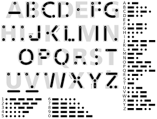

# [CODE] Chapter02 : 부호와 조합 - 2022.03.14

## 새뮤얼 핀리 브리즈 모스
- 모스 코드가 개발되어 조작자들이 종이 테이프에 적힌 자국을 텍스트 메시지로 해석할 수 있었다.  
  초기 코드에서 모스는 숫자만을 전송할 계획이었다.  
  그러나 이 코드는 앨프리드 베일이 일반 문자와 특수 문자를 포함, 확장시켰고 일반화되었다.

## 모스부호

### 특징
- 모스부호는 점과 선으로 이루어진 이진부호라고 이야기 할 수 있다.
- 이진 부호는 항상 2의 거듭제곱수로 그 결과를 표현 할 수 있다.
- 모스부호는 보내는 것보다 받는 쪽이 불리한데  
  이것은 점과 선에 알파벳과 맞는 규칙이 없기 때문이다.
- 알파벳의 경우 2^4 로 표현이 가능하며  
  2^6의 표에는 undefined가 상당수 이다.

### TMI
- 점 하나와 선 하나만으로 표현할 수 있는 문자는, E와 T이다.
- 이진법은 라이프니츠가 음양사상의 영향을 받아 발명하였다.

## 조합론(조합적 분석)
- 주로 확률과 통계분야에서 가장 많이 사용되고 있지만  
  부호가 어떻게 조합되고 분석되는지를 이해하는데도 도움이 될 것 같다.