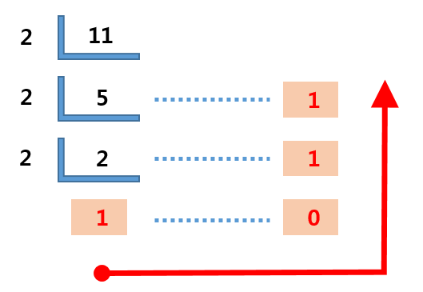
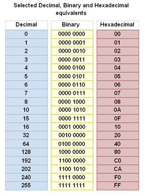

# [CODE] Chapter08 : 십진수 이외의 것 - 2022.03.18

<!-- TOC -->

- [[CODE] Chapter08 : 십진수 이외의 것 - 2022.03.18](#code-chapter08--%EC%8B%AD%EC%A7%84%EC%88%98-%EC%9D%B4%EC%99%B8%EC%9D%98-%EA%B2%83---20220318)
  - [10에 기반을 두지 않은 수체계](#10%EC%97%90-%EA%B8%B0%EB%B0%98%EC%9D%84-%EB%91%90%EC%A7%80-%EC%95%8A%EC%9D%80-%EC%88%98%EC%B2%B4%EA%B3%84)
    - [8진수 4진수](#8%EC%A7%84%EC%88%98-4%EC%A7%84%EC%88%98)
    - [8진수 정수 4진수 정수](#8%EC%A7%84%EC%88%98-%EC%A0%95%EC%88%98-4%EC%A7%84%EC%88%98-%EC%A0%95%EC%88%98)
    - [2진수](#2%EC%A7%84%EC%88%98)
    - [TMI](#tmi)
    - [16진수](#16%EC%A7%84%EC%88%98)

<!-- /TOC -->

## `10에 기반을 두지 않은 수체계`
### `8진수 (4진수)`
- 십진수에서 "십"을 표현하는 기호를 사용하지 않은 것 처럼  
  팔진수에서도 "팔"을 표현하는 기호는 필요하지 않다.
- 십진수 - 팔진수 비교
  7(Ten) - 7(EGIHT)  
  8(Ten) - 10(EGIHT)  
  9(Ten) - 11(EGIHT)  
  10(Ten) - 12(EGIHT)  
  24(Ten) - 30(EGIHT)  
  64(Ten) - 100(EGIHT)  
  100(Ten) - 144(EGIHT)  
  128(Ten) - 200(EGIHT)  
  256(Ten) - 400(EGIHT)  

### `8진수 정수 (4진수 정수)`
- 100(EGIHT), 200(EGIHT), 400(EGIHT) 과 같이  
  팔진수로 딱 떨어지는 숫자들은 모두 8의 거듭제곱수가 곱해진 값들이다.

### `2진수`
- 1과 0으로만 이루어진 수체계
- 전류, 전구, 릴레이, 스위치 등 모두 이진수로 표현할 수 있다.
- 십진수를 이진수로 변환하는 방법  
  

### `TMI`
- 미국의 수학자 존 와이더 터키는 이진수의 중요성을 알았고,  
  이진수라는 단어를 간결하게 표현하기 위해  
  bigit, binit과 같은 단어를 고려하다가 **bit**로 결정되었다.

### `16진수`
- 10진수, 2진수, 16진수  
  
