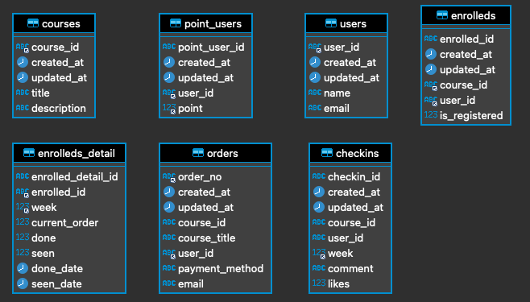

# 엑셀보다 쉬운 SQL - 1주차
1. 데이터베이스(DB)와 SQL이 왜 필요한지 이해한다.
2. DB에서 데이터를 가져오는 기초적인 문법인 Select와 Where문을 이해한다.
3. 조금 더 복잡한 분석을 위해 자주 사용되는 유용한 문법을 익힌다.

## 설치 프로그램
- MySQL
- dbeaver

## 테이블 구조


## WHERE
포인트가 20000점보다 많은 유저
``` SQL
select * from point_users
where point > 20000;
```

성이 황씨인 유저
``` SQL
select * from users
where name = "황**";
```

웹개발 종합반이면서 결제수단이 CARD인 주문건
``` SQL
select * from orders
where course_title = "웹개발 종합반" and payment_method = "CARD";
```

## WHERE++
결제수단이 CARD가 아닌 주문데이터
``` SQL
select * from orders
where payment_method != 'CARD';
```
20000~30000 포인트 보유하고 있는 유저
``` SQL
select * from point_users
where point between 20000 and 30000;
```
이메일이 s로 시작하고 com로 끝나면서 성이 이씨인 유저
``` SQL
select * from users
where email like 's%com' and name like '이%';
```

### LIKE 
- where email like 'a%': email 필드값이 a로 시작하는 모든 데이터
- where email like '%a' email 필드값이 a로 끝나는 모든 데이터
- where email like '%co%' email 필드값에 co를 포함하는 모든 데이터
- where email like 'a%o' email 필드값이 a로 시작하고 o로 끝나는 모든 데이터

## 유용한 문법
### Limit
``` SQL
select * from orders 
where payment_method = "kakaopay"
limit 5;
```
### Distinct
``` SQL
select distinct(payment_method) from orders;
```
### Count
``` SQL
select count(*) from orders
```

### Distinct, Count 조합
``` SQL
SELECT count(distinct(name)) from users;
```

## 퀴즈
성이 남씨인 유저의 이메일
``` SQL
select u.email 
from users u 
where u.name like '남%'
```

Gmail을 사용하는 2020/07/12~13에 가입한 유저
Gmail을 사용하는 2020/07/12~13에 가입한 유저의 수
``` SQL
select *
from users u
where u.email like '%gmail%' and u.created_at between '2020-07-12' and '2020-07-14'

select count(*)
from users u
where u.email like '%gmail%' and u.created_at between '2020-07-12' and '2020-07-14'
```

naver 이메일을 사용하면서, 웹개발 종합반을 신청했고 결제는 kakaopay로 이뤄진 주문데이터
``` SQL
select o.*
from   orders o
where  o.email like '%naver.com' 
and    o.course_title = '웹개발 종합반'
and    o.payment_method = 'kakaopay';
```